# Design Document

## Overview

本設計文檔定義了 Dart Web3 SDK 的架構設計，基於 28 個需求規格，打造一個純 Dart 實現的模組化 Web3 SDK。設計參考了 viem、alloy、ethers.js 等成熟 SDK 的架構模式，並結合 Dart 生態系統的特點，提供類型安全、高性能的區塊鏈開發體驗。

**核心設計原則：**
- **純 Dart 實現**：無任何原生依賴（FFI、C++、Rust bindings），支援所有 Dart/Flutter 平台
- **模組化架構**：每個套件可獨立使用，最小化依賴關係
- **類型安全**：充分利用 Dart 的類型系統，提供編譯時錯誤檢查
- **多鏈支援**：核心支援 EVM 鏈，透過擴展模組支援其他區塊鏈
- **可擴展性**：提供清晰的擴展點，支援自定義實現

**架構靈感來源：**
- **viem**：PublicClient/WalletClient 分離、Actions API、Transport 抽象
- **alloy**：模組化 crate 結構、類型安全的 ABI 處理
- **blockchain_utils**：純 Dart 密碼學實現
- **on_chain**：多鏈交易構建模式

## Architecture

### 整體架構圖

```mermaid
graph TB
    subgraph "Level 0 - Core"
        Core[dart_web3_core<br/>地址、BigInt、編碼、RLP]
    end
    
    subgraph "Level 1 - Primitives"
        Crypto[dart_web3_crypto<br/>secp256k1、keccak、BIP]
        ABI[dart_web3_abi<br/>ABI 編碼/解碼]
    end
    
    subgraph "Level 2 - Transport"
        Provider[dart_web3_provider<br/>HTTP/WebSocket RPC]
        Signer[dart_web3_signer<br/>簽名器抽象]
        Chains[dart_web3_chains<br/>鏈配置]
    end
    
    subgraph "Level 3 - Clients"
        Client[dart_web3_client<br/>PublicClient/WalletClient]
        Contract[dart_web3_contract<br/>合約抽象]
        Events[dart_web3_events<br/>事件訂閱]
    end
    
    subgraph "Level 4 - Services"
        Multicall[dart_web3_multicall]
        ENS[dart_web3_ens]
        History[dart_web3_history]
        Price[dart_web3_price]
    end
    
    subgraph "Level 5 - Advanced"
        AA[dart_web3_aa<br/>ERC-4337]
        Reown[dart_web3_reown<br/>WalletConnect v2]
        Swap[dart_web3_swap]
        Bridge[dart_web3_bridge]
        NFT[dart_web3_nft]
        Staking[dart_web3_staking]
        DApp[dart_web3_dapp]
        Debug[dart_web3_debug]
        MEV[dart_web3_mev]
    end
    
    subgraph "Level 6 - Hardware"
        BCUR[dart_web3_bc_ur]
        Keystone[dart_web3_keystone]
        Ledger[dart_web3_ledger]
        Trezor[dart_web3_trezor]
        MPC[dart_web3_mpc]
    end
    
    subgraph "Level 7 - Extensions"
        Solana[dart_web3_solana]
        Polkadot[dart_web3_polkadot]
        Tron[dart_web3_tron]
        TON[dart_web3_ton]
        Bitcoin[dart_web3_bitcoin]
    end
    
    Core --> Crypto
    Core --> ABI
    Core --> Provider
    Core --> Signer
    Core --> Chains
    
    Crypto --> Client
    ABI --> Client
    Provider --> Client
    Signer --> Client
    Chains --> Client
    
    Client --> Contract
    Client --> Events
    Client --> Multicall
    Client --> ENS
    Client --> History
    Client --> Price
    
    Client --> AA
    Client --> Reown
    Client --> Swap
    Client --> Bridge
    Client --> NFT
    Client --> Staking
    Client --> DApp
    Client --> Debug
    Client --> MEV
    
    Signer --> Keystone
    Signer --> Ledger
    Signer --> Trezor
    Signer --> MPC
    
    BCUR --> Keystone
```



### 依賴層級設計

採用嚴格的分層架構，確保：
1. **無循環依賴**：上層可依賴下層，但下層不能依賴上層
2. **最小依賴**：每個套件只依賴必要的下層套件
3. **獨立可用**：每個套件都可以獨立使用
4. **清晰邊界**：每層都有明確的職責範圍

## Components and Interfaces

### Level 0: Core Module (dart_web3_core)

**職責**：提供基礎工具類，無外部依賴

```dart
// 地址處理
class EthereumAddress {
  final String address;
  
  EthereumAddress(this.address);
  
  static EthereumAddress fromHex(String hex);
  static EthereumAddress fromPublicKey(Uint8List publicKey);
  
  String toChecksum(); // EIP-55
  bool isValid();
  bool isContract(); // 需要 RPC 查詢
}

// 大整數工具
class EthUnit {
  static BigInt wei(String value);
  static BigInt gwei(String value);
  static BigInt ether(String value);
  
  static String formatWei(BigInt wei);
  static String formatGwei(BigInt gwei);
  static String formatEther(BigInt wei);
}

// 十六進制編碼
class HexUtils {
  static String encode(Uint8List bytes, {bool prefix = true});
  static Uint8List decode(String hex);
  static bool isValid(String hex);
}

// RLP 編碼
class RLP {
  static Uint8List encode(dynamic data);
  static dynamic decode(Uint8List data);
}

// 字節工具
class BytesUtils {
  static Uint8List concat(List<Uint8List> arrays);
  static Uint8List slice(Uint8List data, int start, [int? end]);
  static bool equals(Uint8List a, Uint8List b);
  static Uint8List pad(Uint8List data, int length, {bool left = true});
}
```

### Level 1: Crypto Module (dart_web3_crypto)

**職責**：純 Dart 密碼學實現，參考 blockchain_utils

```dart
// secp256k1 橢圓曲線
class Secp256k1 {
  static Uint8List sign(Uint8List message, Uint8List privateKey);
  static Uint8List recover(Uint8List signature, Uint8List messageHash);
  static Uint8List getPublicKey(Uint8List privateKey);
  static bool verify(Uint8List signature, Uint8List message, Uint8List publicKey);
}

// Keccak-256 哈希
class Keccak256 {
  static Uint8List hash(Uint8List data);
  static String hashHex(String data);
}

// BIP-39 助記詞
class Mnemonic {
  static List<String> generate({int strength = 128});
  static Uint8List toSeed(List<String> words, {String passphrase = ''});
  static bool validate(List<String> words);
}

// BIP-32/44 分層確定性錢包
class HDWallet {
  final Uint8List privateKey;
  final Uint8List publicKey;
  final Uint8List chainCode;
  final int depth;
  final String path;
  
  HDWallet.fromSeed(Uint8List seed);
  HDWallet.fromMnemonic(List<String> words, {String passphrase = ''});
  
  HDWallet derive(String path);
  HDWallet deriveChild(int index, {bool hardened = false});
  
  EthereumAddress getAddress();
  Uint8List getPrivateKey();
}

// 多曲線支援
abstract class CurveInterface {
  Uint8List sign(Uint8List message, Uint8List privateKey);
  Uint8List getPublicKey(Uint8List privateKey);
  bool verify(Uint8List signature, Uint8List message, Uint8List publicKey);
}

class Ed25519 implements CurveInterface { /* Solana/Polkadot */ }
class Sr25519 implements CurveInterface { /* Polkadot */ }
```

### Level 1: ABI Module (dart_web3_abi)

**職責**：ABI 編碼/解碼，參考 Solidity ABI 規範

```dart
// ABI 類型系統
abstract class AbiType {
  String get name;
  bool get isDynamic;
  
  Uint8List encode(dynamic value);
  dynamic decode(Uint8List data, int offset);
  int getSize();
}

class AbiUint extends AbiType {
  final int bits;
  AbiUint(this.bits);
}

class AbiAddress extends AbiType { }
class AbiBytes extends AbiType { }
class AbiString extends AbiType { }
class AbiArray extends AbiType {
  final AbiType elementType;
  final int? length; // null for dynamic arrays
  AbiArray(this.elementType, [this.length]);
}

class AbiTuple extends AbiType {
  final List<AbiType> components;
  AbiTuple(this.components);
}

// ABI 編碼器
class AbiEncoder {
  static Uint8List encode(List<AbiType> types, List<dynamic> values);
  static Uint8List encodePacked(List<AbiType> types, List<dynamic> values);
  static String encodeFunction(String signature, List<dynamic> args);
}

// ABI 解碼器
class AbiDecoder {
  static List<dynamic> decode(List<AbiType> types, Uint8List data);
  static Map<String, dynamic> decodeFunction(String abi, Uint8List data);
  static Map<String, dynamic> decodeEvent(String abi, List<String> topics, Uint8List data);
}

// EIP-712 結構化資料
class TypedData {
  final Map<String, dynamic> domain;
  final Map<String, List<Map<String, String>>> types;
  final String primaryType;
  final Map<String, dynamic> message;
  
  TypedData({
    required this.domain,
    required this.types,
    required this.primaryType,
    required this.message,
  });
  
  Uint8List hash();
  String encode();
}

// ABI JSON 解析器
class AbiParser {
  static List<AbiFunction> parseFunctions(String abiJson);
  static List<AbiEvent> parseEvents(String abiJson);
  static List<AbiError> parseErrors(String abiJson);
}

class AbiFunction {
  final String name;
  final List<AbiType> inputs;
  final List<AbiType> outputs;
  final String stateMutability;
  
  String getSelector();
  Uint8List encodeCall(List<dynamic> args);
  List<dynamic> decodeOutput(Uint8List data);
}

class AbiEvent {
  final String name;
  final List<AbiType> inputs;
  final bool anonymous;
  
  String getTopic();
  Map<String, dynamic> decode(List<String> topics, Uint8List data);
}
```

### Level 2: Provider Module (dart_web3_provider)

**職責**：RPC 通訊抽象，支援 HTTP/WebSocket

```dart
// Transport 抽象
abstract class Transport {
  Future<Map<String, dynamic>> request(String method, List<dynamic> params);
  Future<List<Map<String, dynamic>>> batchRequest(List<RpcRequest> requests);
  void dispose();
}

class RpcRequest {
  final String method;
  final List<dynamic> params;
  final String? id;
  
  RpcRequest(this.method, this.params, [this.id]);
}

// HTTP Transport
class HttpTransport implements Transport {
  final String url;
  final Map<String, String> headers;
  final Duration timeout;
  
  HttpTransport(this.url, {
    this.headers = const {},
    this.timeout = const Duration(seconds: 30),
  });
  
  @override
  Future<Map<String, dynamic>> request(String method, List<dynamic> params);
  
  @override
  Future<List<Map<String, dynamic>>> batchRequest(List<RpcRequest> requests);
}

// WebSocket Transport
class WebSocketTransport implements Transport {
  final String url;
  final Duration reconnectDelay;
  final int maxReconnectAttempts;
  
  WebSocketTransport(this.url, {
    this.reconnectDelay = const Duration(seconds: 5),
    this.maxReconnectAttempts = 3,
  });
  
  Stream<Map<String, dynamic>> subscribe(String method, List<dynamic> params);
  Future<void> unsubscribe(String subscriptionId);
}

// Middleware 系統
abstract class Middleware {
  Future<Map<String, dynamic>> beforeRequest(String method, List<dynamic> params);
  Future<Map<String, dynamic>> afterResponse(Map<String, dynamic> response);
  Future<void> onError(Exception error);
}

class RetryMiddleware implements Middleware {
  final int maxRetries;
  final Duration delay;
  
  RetryMiddleware({this.maxRetries = 3, this.delay = const Duration(seconds: 1)});
}

class LoggingMiddleware implements Middleware {
  final bool logRequests;
  final bool logResponses;
  
  LoggingMiddleware({this.logRequests = true, this.logResponses = false});
}

// RPC Provider
class RpcProvider {
  final Transport transport;
  final List<Middleware> middlewares;
  
  RpcProvider(this.transport, {this.middlewares = const []});
  
  Future<T> call<T>(String method, List<dynamic> params);
  Future<List<T>> batchCall<T>(List<RpcRequest> requests);
  
  // 常用 RPC 方法
  Future<String> getChainId();
  Future<BigInt> getBlockNumber();
  Future<Map<String, dynamic>> getBlock(String blockHash);
  Future<BigInt> getBalance(String address, [String block = 'latest']);
  Future<String> sendRawTransaction(String signedTx);
  Future<Map<String, dynamic>> getTransactionReceipt(String txHash);
}
```
### Level 2: Signer Module (dart_web3_signer)

**職責**：簽名器抽象，支援多種簽名方式

```dart
// 簽名器抽象介面
abstract class Signer {
  EthereumAddress get address;
  
  Future<String> signTransaction(TransactionRequest transaction);
  Future<String> signMessage(String message);
  Future<String> signTypedData(TypedData typedData);
  
  // EIP-7702 授權簽名
  Future<String> signAuthorization(Authorization authorization);
}

// 交易請求
class TransactionRequest {
  final String? to;
  final BigInt? value;
  final Uint8List? data;
  final BigInt? gasLimit;
  final BigInt? gasPrice;
  final BigInt? maxFeePerGas;
  final BigInt? maxPriorityFeePerGas;
  final BigInt? nonce;
  final int? chainId;
  final TransactionType type;
  
  // EIP-2930 Access List
  final List<AccessListEntry>? accessList;
  
  // EIP-4844 Blob Transaction
  final List<String>? blobVersionedHashes;
  final BigInt? maxFeePerBlobGas;
  
  // EIP-7702 Authorization List
  final List<Authorization>? authorizationList;
}

enum TransactionType {
  legacy,      // Type 0
  eip2930,     // Type 1 - Access List
  eip1559,     // Type 2 - Fee Market
  eip4844,     // Type 3 - Blob Transaction
  eip7702,     // Type 4 - EOA Code Delegation
}

class AccessListEntry {
  final String address;
  final List<String> storageKeys;
}

class Authorization {
  final int chainId;
  final String address;
  final BigInt nonce;
  final int yParity;
  final BigInt r;
  final BigInt s;
}

// 私鑰簽名器
class PrivateKeySigner implements Signer {
  final Uint8List privateKey;
  final int chainId;
  
  PrivateKeySigner(this.privateKey, this.chainId);
  
  factory PrivateKeySigner.fromHex(String hex, int chainId);
  factory PrivateKeySigner.fromMnemonic(List<String> words, int chainId, {String path = "m/44'/60'/0'/0/0"});
  
  @override
  EthereumAddress get address => EthereumAddress.fromPublicKey(
    Secp256k1.getPublicKey(privateKey)
  );
}

// 硬體錢包簽名器抽象
abstract class HardwareWalletSigner implements Signer {
  Future<bool> isConnected();
  Future<void> connect();
  Future<void> disconnect();
  Future<List<EthereumAddress>> getAddresses({int count = 5, int offset = 0});
}

// MPC 簽名器抽象
abstract class MpcSigner implements Signer {
  final String partyId;
  final int threshold;
  final int totalParties;
  
  MpcSigner(this.partyId, this.threshold, this.totalParties);
  
  Future<void> startKeyGeneration();
  Future<void> refreshKeys();
  Future<SigningSession> startSigning(Uint8List messageHash);
}

class SigningSession {
  final String sessionId;
  final List<String> requiredParties;
  
  Future<String> waitForCompletion();
  Future<void> cancel();
}
```

### Level 2: Chains Module (dart_web3_chains)

**職責**：鏈配置管理

```dart
// 鏈配置
class ChainConfig {
  final int chainId;
  final String name;
  final String shortName;
  final String nativeCurrency;
  final String symbol;
  final int decimals;
  final List<String> rpcUrls;
  final List<String> blockExplorerUrls;
  final String? iconUrl;
  final bool testnet;
  
  // 合約地址
  final String? multicallAddress;
  final String? ensRegistryAddress;
  
  ChainConfig({
    required this.chainId,
    required this.name,
    required this.shortName,
    required this.nativeCurrency,
    required this.symbol,
    required this.decimals,
    required this.rpcUrls,
    required this.blockExplorerUrls,
    this.iconUrl,
    this.testnet = false,
    this.multicallAddress,
    this.ensRegistryAddress,
  });
}

// 預定義鏈配置
class Chains {
  static final ethereum = ChainConfig(
    chainId: 1,
    name: 'Ethereum Mainnet',
    shortName: 'eth',
    nativeCurrency: 'Ether',
    symbol: 'ETH',
    decimals: 18,
    rpcUrls: ['https://eth.llamarpc.com'],
    blockExplorerUrls: ['https://etherscan.io'],
    multicallAddress: '0xcA11bde05977b3631167028862bE2a173976CA11',
    ensRegistryAddress: '0x00000000000C2E074eC69A0dFb2997BA6C7d2e1e',
  );
  
  static final polygon = ChainConfig(
    chainId: 137,
    name: 'Polygon Mainnet',
    shortName: 'matic',
    nativeCurrency: 'MATIC',
    symbol: 'MATIC',
    decimals: 18,
    rpcUrls: ['https://polygon.llamarpc.com'],
    blockExplorerUrls: ['https://polygonscan.com'],
    multicallAddress: '0xcA11bde05977b3631167028862bE2a173976CA11',
  );
  
  // ... 其他鏈配置
  
  static ChainConfig? getById(int chainId);
  static List<ChainConfig> getAllChains();
  static void registerChain(ChainConfig chain);
}
```

### Level 3: Client Module (dart_web3_client)

**職責**：PublicClient/WalletClient 實現，參考 viem 架構

```dart
// 公共客戶端（只讀操作）
class PublicClient {
  final RpcProvider provider;
  final ChainConfig chain;
  
  PublicClient({
    required this.provider,
    required this.chain,
  });
  
  // 區塊鏈查詢
  Future<BigInt> getBalance(String address, [String block = 'latest']);
  Future<Map<String, dynamic>> getBlock(String blockHash);
  Future<BigInt> getBlockNumber();
  Future<Map<String, dynamic>> getTransaction(String txHash);
  Future<Map<String, dynamic>?> getTransactionReceipt(String txHash);
  Future<BigInt> getTransactionCount(String address, [String block = 'latest']);
  
  // 合約調用
  Future<Uint8List> call(CallRequest request, [String block = 'latest']);
  Future<BigInt> estimateGas(CallRequest request);
  
  // 事件查詢
  Future<List<Log>> getLogs(LogFilter filter);
  
  // EIP-1559 費用估算
  Future<FeeData> getFeeData();
  Future<BigInt> getGasPrice();
  
  // 鏈資訊
  Future<int> getChainId();
  Future<String> getClientVersion();
}

class CallRequest {
  final String? from;
  final String to;
  final Uint8List? data;
  final BigInt? value;
  final BigInt? gasLimit;
  final BigInt? gasPrice;
  final BigInt? maxFeePerGas;
  final BigInt? maxPriorityFeePerGas;
  
  // EIP-2930 Access List
  final List<AccessListEntry>? accessList;
  
  // State Override (for simulation)
  final Map<String, StateOverride>? stateOverride;
}

class StateOverride {
  final BigInt? balance;
  final BigInt? nonce;
  final Uint8List? code;
  final Map<String, String>? state;
  final Map<String, String>? stateDiff;
}

class FeeData {
  final BigInt gasPrice;
  final BigInt maxFeePerGas;
  final BigInt maxPriorityFeePerGas;
}

class Log {
  final String address;
  final List<String> topics;
  final Uint8List data;
  final String blockHash;
  final BigInt blockNumber;
  final String transactionHash;
  final int transactionIndex;
  final int logIndex;
  final bool removed;
}

class LogFilter {
  final String? address;
  final List<String>? topics;
  final String? fromBlock;
  final String? toBlock;
}

// 錢包客戶端（包含簽名功能）
class WalletClient extends PublicClient {
  final Signer signer;
  
  WalletClient({
    required RpcProvider provider,
    required ChainConfig chain,
    required this.signer,
  }) : super(provider: provider, chain: chain);
  
  EthereumAddress get address => signer.address;
  
  // 交易發送
  Future<String> sendTransaction(TransactionRequest request);
  Future<String> sendRawTransaction(String signedTx);
  
  // 簽名操作
  Future<String> signMessage(String message);
  Future<String> signTypedData(TypedData typedData);
  Future<String> signTransaction(TransactionRequest transaction);
  
  // EIP-7702 授權
  Future<String> signAuthorization(Authorization authorization);
  
  // 便利方法
  Future<String> transfer(String to, BigInt amount);
  Future<TransactionRequest> prepareTransaction(TransactionRequest request);
}

// 客戶端工廠
class ClientFactory {
  static PublicClient createPublicClient({
    required String rpcUrl,
    required ChainConfig chain,
    List<Middleware>? middlewares,
  }) {
    final transport = HttpTransport(rpcUrl);
    final provider = RpcProvider(transport, middlewares: middlewares ?? []);
    return PublicClient(provider: provider, chain: chain);
  }
  
  static WalletClient createWalletClient({
    required String rpcUrl,
    required ChainConfig chain,
    required Signer signer,
    List<Middleware>? middlewares,
  }) {
    final transport = HttpTransport(rpcUrl);
    final provider = RpcProvider(transport, middlewares: middlewares ?? []);
    return WalletClient(provider: provider, chain: chain, signer: signer);
  }
}
```
### Level 3: Contract Module (dart_web3_contract)

**職責**：智能合約抽象，提供類型安全的合約互動

```dart
// 合約抽象
class Contract {
  final String address;
  final List<AbiFunction> functions;
  final List<AbiEvent> events;
  final PublicClient publicClient;
  final WalletClient? walletClient;
  
  Contract({
    required this.address,
    required String abi,
    required this.publicClient,
    this.walletClient,
  }) : functions = AbiParser.parseFunctions(abi),
       events = AbiParser.parseEvents(abi);
  
  // 只讀調用
  Future<List<dynamic>> read(String functionName, List<dynamic> args, [String block = 'latest']);
  
  // 寫入調用（需要 WalletClient）
  Future<String> write(String functionName, List<dynamic> args, {
    BigInt? value,
    BigInt? gasLimit,
    BigInt? gasPrice,
    BigInt? maxFeePerGas,
    BigInt? maxPriorityFeePerGas,
  });
  
  // 模擬調用
  Future<SimulateResult> simulate(String functionName, List<dynamic> args, {
    String? from,
    BigInt? value,
    String block = 'latest',
    Map<String, StateOverride>? stateOverride,
  });
  
  // 估算 Gas
  Future<BigInt> estimateGas(String functionName, List<dynamic> args, {
    String? from,
    BigInt? value,
  });
  
  // 事件過濾器
  EventFilter createEventFilter(String eventName, {
    Map<String, dynamic>? indexedArgs,
    String? fromBlock,
    String? toBlock,
  });
  
  // 解碼事件日誌
  Map<String, dynamic>? decodeEventLog(Log log);
  
  // 解碼錯誤
  String? decodeError(Uint8List data);
}

class SimulateResult {
  final List<dynamic> result;
  final BigInt gasUsed;
  final bool success;
  final String? revertReason;
}

// 合約工廠
class ContractFactory {
  static Contract create({
    required String address,
    required String abi,
    required PublicClient publicClient,
    WalletClient? walletClient,
  }) {
    return Contract(
      address: address,
      abi: abi,
      publicClient: publicClient,
      walletClient: walletClient,
    );
  }
  
  // 部署合約
  static Future<String> deploy({
    required String bytecode,
    required String abi,
    required WalletClient walletClient,
    List<dynamic> constructorArgs = const [],
    BigInt? value,
    BigInt? gasLimit,
  });
}

// 類型安全的合約生成器（類似 Rust 的 sol! 宏）
abstract class TypedContract extends Contract {
  TypedContract({
    required String address,
    required PublicClient publicClient,
    WalletClient? walletClient,
  }) : super(
    address: address,
    abi: getAbi(),
    publicClient: publicClient,
    walletClient: walletClient,
  );
  
  static String getAbi();
}

// ERC-20 合約範例
class ERC20Contract extends TypedContract {
  ERC20Contract({
    required String address,
    required PublicClient publicClient,
    WalletClient? walletClient,
  }) : super(
    address: address,
    publicClient: publicClient,
    walletClient: walletClient,
  );
  
  static String getAbi() => '''[
    {"type":"function","name":"balanceOf","inputs":[{"name":"account","type":"address"}],"outputs":[{"name":"","type":"uint256"}],"stateMutability":"view"},
    {"type":"function","name":"transfer","inputs":[{"name":"to","type":"address"},{"name":"amount","type":"uint256"}],"outputs":[{"name":"","type":"bool"}],"stateMutability":"nonpayable"},
    {"type":"function","name":"approve","inputs":[{"name":"spender","type":"address"},{"name":"amount","type":"uint256"}],"outputs":[{"name":"","type":"bool"}],"stateMutability":"nonpayable"},
    {"type":"event","name":"Transfer","inputs":[{"name":"from","type":"address","indexed":true},{"name":"to","type":"address","indexed":true},{"name":"value","type":"uint256","indexed":false}]}
  ]''';
  
  // 類型安全的方法
  Future<BigInt> balanceOf(String account) async {
    final result = await read('balanceOf', [account]);
    return result[0] as BigInt;
  }
  
  Future<String> transfer(String to, BigInt amount) async {
    return await write('transfer', [to, amount]);
  }
  
  Future<String> approve(String spender, BigInt amount) async {
    return await write('approve', [spender, amount]);
  }
  
  EventFilter transferFilter({String? from, String? to}) {
    return createEventFilter('Transfer', indexedArgs: {
      if (from != null) 'from': from,
      if (to != null) 'to': to,
    });
  }
}
```

### Level 3: Events Module (dart_web3_events)

**職責**：事件訂閱和監聽

```dart
// 事件過濾器
class EventFilter {
  final String? address;
  final List<String>? topics;
  final String? fromBlock;
  final String? toBlock;
  
  EventFilter({
    this.address,
    this.topics,
    this.fromBlock,
    this.toBlock,
  });
}

// 事件訂閱器
class EventSubscriber {
  final PublicClient publicClient;
  final WebSocketTransport? wsTransport;
  
  EventSubscriber(this.publicClient, [this.wsTransport]);
  
  // 訂閱事件（WebSocket）
  Stream<Log> subscribe(EventFilter filter) {
    if (wsTransport == null) {
      throw Exception('WebSocket transport required for subscriptions');
    }
    
    return wsTransport!.subscribe('eth_subscribe', ['logs', filter.toJson()])
        .map((data) => Log.fromJson(data));
  }
  
  // 輪詢事件（HTTP）
  Stream<Log> poll(EventFilter filter, {Duration interval = const Duration(seconds: 5)}) {
    return Stream.periodic(interval).asyncMap((_) async {
      final logs = await publicClient.getLogs(filter);
      return logs;
    }).expand((logs) => logs);
  }
  
  // 監聽新區塊
  Stream<BigInt> watchBlockNumber({Duration interval = const Duration(seconds: 12)}) {
    if (wsTransport != null) {
      return wsTransport!.subscribe('eth_subscribe', ['newHeads'])
          .map((data) => BigInt.parse(data['number']));
    } else {
      return Stream.periodic(interval).asyncMap((_) => publicClient.getBlockNumber());
    }
  }
  
  // 監聽待處理交易
  Stream<String> watchPendingTransactions() {
    if (wsTransport == null) {
      throw Exception('WebSocket transport required for pending transactions');
    }
    
    return wsTransport!.subscribe('eth_subscribe', ['newPendingTransactions'])
        .map((data) => data as String);
  }
}

// 事件監聽器
class EventListener {
  final EventSubscriber subscriber;
  final Map<String, StreamSubscription> _subscriptions = {};
  
  EventListener(this.subscriber);
  
  // 監聽合約事件
  void listenToContract(Contract contract, String eventName, {
    Map<String, dynamic>? indexedArgs,
    required void Function(Map<String, dynamic>) onEvent,
    void Function(Exception)? onError,
  }) {
    final filter = contract.createEventFilter(eventName, indexedArgs: indexedArgs);
    final key = '${contract.address}_$eventName';
    
    _subscriptions[key] = subscriber.subscribe(filter).listen(
      (log) {
        final decoded = contract.decodeEventLog(log);
        if (decoded != null) {
          onEvent(decoded);
        }
      },
      onError: onError,
    );
  }
  
  // 停止監聽
  void stopListening(String key) {
    _subscriptions[key]?.cancel();
    _subscriptions.remove(key);
  }
  
  void stopAll() {
    for (final subscription in _subscriptions.values) {
      subscription.cancel();
    }
    _subscriptions.clear();
  }
}

// 事件歷史查詢
class EventHistory {
  final PublicClient publicClient;
  
  EventHistory(this.publicClient);
  
  // 查詢歷史事件
  Future<List<Log>> getEvents(EventFilter filter, {
    int? limit,
    bool ascending = true,
  }) async {
    final logs = await publicClient.getLogs(filter);
    
    if (!ascending) {
      logs.sort((a, b) => b.blockNumber.compareTo(a.blockNumber));
    }
    
    if (limit != null && logs.length > limit) {
      return logs.take(limit).toList();
    }
    
    return logs;
  }
  
  // 分頁查詢
  Future<List<Log>> getEventsPaginated(EventFilter filter, {
    required int page,
    required int pageSize,
    bool ascending = true,
  }) async {
    final allLogs = await getEvents(filter, ascending: ascending);
    final startIndex = page * pageSize;
    final endIndex = (startIndex + pageSize).clamp(0, allLogs.length);
    
    return allLogs.sublist(startIndex, endIndex);
  }
}
```
## Data Models

### 核心數據類型

```dart
// 區塊資料
class Block {
  final String hash;
  final String parentHash;
  final BigInt number;
  final BigInt timestamp;
  final String miner;
  final BigInt difficulty;
  final BigInt totalDifficulty;
  final BigInt gasLimit;
  final BigInt gasUsed;
  final BigInt baseFeePerGas;
  final List<String> transactions;
  final String stateRoot;
  final String transactionsRoot;
  final String receiptsRoot;
  final int size;
  final String extraData;
  final String logsBloom;
  final String mixHash;
  final String nonce;
  
  Block({
    required this.hash,
    required this.parentHash,
    required this.number,
    required this.timestamp,
    required this.miner,
    required this.difficulty,
    required this.totalDifficulty,
    required this.gasLimit,
    required this.gasUsed,
    required this.baseFeePerGas,
    required this.transactions,
    required this.stateRoot,
    required this.transactionsRoot,
    required this.receiptsRoot,
    required this.size,
    required this.extraData,
    required this.logsBloom,
    required this.mixHash,
    required this.nonce,
  });
  
  factory Block.fromJson(Map<String, dynamic> json);
  Map<String, dynamic> toJson();
}

// 交易資料
class Transaction {
  final String hash;
  final String blockHash;
  final BigInt blockNumber;
  final int transactionIndex;
  final String from;
  final String? to;
  final BigInt value;
  final BigInt gasLimit;
  final BigInt gasPrice;
  final BigInt? maxFeePerGas;
  final BigInt? maxPriorityFeePerGas;
  final Uint8List data;
  final BigInt nonce;
  final int chainId;
  final TransactionType type;
  final List<AccessListEntry>? accessList;
  final List<String>? blobVersionedHashes;
  final BigInt? maxFeePerBlobGas;
  final List<Authorization>? authorizationList;
  
  // 簽名
  final int v;
  final BigInt r;
  final BigInt s;
  
  Transaction({
    required this.hash,
    required this.blockHash,
    required this.blockNumber,
    required this.transactionIndex,
    required this.from,
    this.to,
    required this.value,
    required this.gasLimit,
    required this.gasPrice,
    this.maxFeePerGas,
    this.maxPriorityFeePerGas,
    required this.data,
    required this.nonce,
    required this.chainId,
    required this.type,
    this.accessList,
    this.blobVersionedHashes,
    this.maxFeePerBlobGas,
    this.authorizationList,
    required this.v,
    required this.r,
    required this.s,
  });
  
  factory Transaction.fromJson(Map<String, dynamic> json);
  Map<String, dynamic> toJson();
  
  // 計算交易費用
  BigInt get effectiveGasPrice {
    switch (type) {
      case TransactionType.legacy:
      case TransactionType.eip2930:
        return gasPrice;
      case TransactionType.eip1559:
      case TransactionType.eip4844:
      case TransactionType.eip7702:
        return maxFeePerGas ?? gasPrice;
    }
  }
  
  BigInt get totalFee => effectiveGasPrice * gasLimit;
}

// 交易收據
class TransactionReceipt {
  final String transactionHash;
  final String blockHash;
  final BigInt blockNumber;
  final int transactionIndex;
  final String from;
  final String? to;
  final String? contractAddress;
  final BigInt gasUsed;
  final BigInt effectiveGasPrice;
  final int status; // 1 = success, 0 = failure
  final List<Log> logs;
  final String logsBloom;
  final TransactionType type;
  
  // EIP-4844 Blob Gas
  final BigInt? blobGasUsed;
  final BigInt? blobGasPrice;
  
  TransactionReceipt({
    required this.transactionHash,
    required this.blockHash,
    required this.blockNumber,
    required this.transactionIndex,
    required this.from,
    this.to,
    this.contractAddress,
    required this.gasUsed,
    required this.effectiveGasPrice,
    required this.status,
    required this.logs,
    required this.logsBloom,
    required this.type,
    this.blobGasUsed,
    this.blobGasPrice,
  });
  
  factory TransactionReceipt.fromJson(Map<String, dynamic> json);
  Map<String, dynamic> toJson();
  
  bool get isSuccess => status == 1;
  bool get isFailure => status == 0;
  BigInt get totalFee => effectiveGasPrice * gasUsed;
}
```

### ERC-4337 Account Abstraction 數據模型

```dart
// UserOperation 結構
class UserOperation {
  final String sender;
  final BigInt nonce;
  final Uint8List initCode;
  final Uint8List callData;
  final BigInt callGasLimit;
  final BigInt verificationGasLimit;
  final BigInt preVerificationGas;
  final BigInt maxFeePerGas;
  final BigInt maxPriorityFeePerGas;
  final Uint8List paymasterAndData;
  final Uint8List signature;
  
  UserOperation({
    required this.sender,
    required this.nonce,
    required this.initCode,
    required this.callData,
    required this.callGasLimit,
    required this.verificationGasLimit,
    required this.preVerificationGas,
    required this.maxFeePerGas,
    required this.maxPriorityFeePerGas,
    required this.paymasterAndData,
    required this.signature,
  });
  
  // 計算 UserOperation Hash
  Uint8List getUserOpHash(String entryPointAddress, int chainId) {
    final encoded = AbiEncoder.encode([
      AbiAddress(), AbiUint(256), AbiBytes(), AbiBytes(),
      AbiUint(256), AbiUint(256), AbiUint(256),
      AbiUint(256), AbiUint(256), AbiBytes()
    ], [
      sender, nonce, initCode, callData,
      callGasLimit, verificationGasLimit, preVerificationGas,
      maxFeePerGas, maxPriorityFeePerGas, paymasterAndData
    ]);
    
    final packed = BytesUtils.concat([
      Keccak256.hash(encoded),
      HexUtils.decode(entryPointAddress),
      BytesUtils.fromBigInt(BigInt.from(chainId), 32),
    ]);
    
    return Keccak256.hash(packed);
  }
  
  factory UserOperation.fromJson(Map<String, dynamic> json);
  Map<String, dynamic> toJson();
}

// UserOperation Receipt
class UserOperationReceipt {
  final String userOpHash;
  final String entryPoint;
  final String sender;
  final BigInt nonce;
  final String? paymaster;
  final BigInt actualGasCost;
  final BigInt actualGasUsed;
  final bool success;
  final String? reason;
  final List<Log> logs;
  final TransactionReceipt receipt;
  
  UserOperationReceipt({
    required this.userOpHash,
    required this.entryPoint,
    required this.sender,
    required this.nonce,
    this.paymaster,
    required this.actualGasCost,
    required this.actualGasUsed,
    required this.success,
    this.reason,
    required this.logs,
    required this.receipt,
  });
  
  factory UserOperationReceipt.fromJson(Map<String, dynamic> json);
}

// Smart Account 抽象
abstract class SmartAccount {
  String get address;
  String get factoryAddress;
  Uint8List get initCode;
  
  Future<UserOperation> createUserOperation({
    required String to,
    required BigInt value,
    required Uint8List data,
    BigInt? nonce,
  });
  
  Future<Uint8List> signUserOperation(UserOperation userOp);
}

// Simple Account 實現
class SimpleAccount extends SmartAccount {
  final Signer owner;
  final String factoryAddress;
  final BigInt salt;
  
  SimpleAccount({
    required this.owner,
    required this.factoryAddress,
    this.salt = BigInt.zero,
  });
  
  @override
  String get address {
    // 計算 CREATE2 地址
    final initCodeHash = Keccak256.hash(initCode);
    final packed = BytesUtils.concat([
      HexUtils.decode('0xff'),
      HexUtils.decode(factoryAddress),
      BytesUtils.fromBigInt(salt, 32),
      initCodeHash,
    ]);
    final hash = Keccak256.hash(packed);
    return HexUtils.encode(hash.sublist(12)); // 取後 20 bytes
  }
  
  @override
  Uint8List get initCode {
    return AbiEncoder.encode([
      AbiAddress(),
      AbiBytes(),
    ], [
      factoryAddress,
      AbiEncoder.encodeFunction('createAccount(address,uint256)', [
        owner.address.address,
        salt,
      ]),
    ]);
  }
}
```

### 硬體錢包數據模型

```dart
// BC-UR 數據結構
class BCUREncoder {
  static List<String> encode(Uint8List data, {
    int maxFragmentLength = 200,
    String type = 'bytes',
  });
  
  static Uint8List decode(List<String> fragments);
}

// Keystone 交易請求
class KeystoneSignRequest {
  final String requestId;
  final Uint8List signData;
  final String derivationPath;
  final String? chainId;
  final TransactionType? transactionType;
  
  KeystoneSignRequest({
    required this.requestId,
    required this.signData,
    required this.derivationPath,
    this.chainId,
    this.transactionType,
  });
  
  List<String> toQRCodes();
}

class KeystoneSignResponse {
  final String requestId;
  final Uint8List signature;
  final String? publicKey;
  
  KeystoneSignResponse({
    required this.requestId,
    required this.signature,
    this.publicKey,
  });
  
  static KeystoneSignResponse fromQRCodes(List<String> qrCodes);
}

// Ledger 通訊協議
class LedgerCommand {
  final int cla;
  final int ins;
  final int p1;
  final int p2;
  final Uint8List? data;
  
  LedgerCommand({
    required this.cla,
    required this.ins,
    required this.p1,
    required this.p2,
    this.data,
  });
  
  Uint8List serialize();
}

class LedgerResponse {
  final Uint8List data;
  final int statusWord;
  
  LedgerResponse(this.data, this.statusWord);
  
  bool get isSuccess => statusWord == 0x9000;
  String get errorMessage => _getErrorMessage(statusWord);
  
  static String _getErrorMessage(int statusWord) {
    switch (statusWord) {
      case 0x6985: return 'User denied';
      case 0x6a80: return 'Invalid data';
      case 0x6e00: return 'Invalid class';
      default: return 'Unknown error: ${statusWord.toRadixString(16)}';
    }
  }
}
```
## Correctness Properties

*A property is a characteristic or behavior that should hold true across all valid executions of a system-essentially, a formal statement about what the system should do. Properties serve as the bridge between human-readable specifications and machine-verifiable correctness guarantees.*

基於需求分析，以下是 Dart Web3 SDK 的核心正確性屬性，這些屬性將透過屬性基礎測試（Property-Based Testing）進行驗證：

### RPC Provider Properties

**Property 1: HTTP RPC Connection Establishment**
*For any* valid HTTP URL, creating an RPC_Provider should successfully establish a connection and support JSON-RPC method calls
**Validates: Requirements 1.1**

**Property 2: WebSocket Persistent Connection**
*For any* valid WebSocket URL, creating an RPC_Provider should establish a persistent connection and support subscription methods
**Validates: Requirements 1.2**

**Property 3: Batch Request Consolidation**
*For any* set of RPC calls, batching them together should send them in a single HTTP request and return all results in the same order
**Validates: Requirements 1.3**

**Property 4: Middleware Execution Order**
*For any* RPC call with registered middleware, the middleware should execute before and after the call in the correct sequence
**Validates: Requirements 1.4**

**Property 5: Error Response Structure**
*For any* failed RPC call, the returned error should contain the error code, message, and data from the node
**Validates: Requirements 1.5**

### Signer Properties

**Property 6: Transaction Signing Interface**
*For any* valid transaction parameters, all Signer implementations should provide a signTransaction method that returns a valid signed transaction
**Validates: Requirements 2.1**

**Property 7: Message Signing Consistency**
*For any* message string, the signMessage method should return a valid Ethereum personal signature that can be verified
**Validates: Requirements 2.2**

**Property 8: EIP-712 Typed Data Signing**
*For any* valid TypedData structure, the signTypedData method should produce a signature that matches the EIP-712 specification
**Validates: Requirements 2.3**

**Property 9: Legacy Transaction EIP-155 Protection**
*For any* legacy transaction, signing should produce R, S, V values with proper chainId protection according to EIP-155
**Validates: Requirements 2.4**

**Property 10: EIP-1559 Fee Field Encoding**
*For any* EIP-1559 transaction, signing should correctly encode maxFeePerGas and maxPriorityFeePerGas fields
**Validates: Requirements 2.5**

**Property 11: Mnemonic to Private Key Derivation**
*For any* valid mnemonic phrase, deriving the private key should follow BIP-39/BIP-44 standards and produce consistent results
**Validates: Requirements 2.10**

### ABI Encoding Properties

**Property 12: ABI Encoding Round Trip**
*For any* valid ABI-encoded data, decoding then encoding should produce equivalent bytes
**Validates: Requirements 3.9**

**Property 13: Function Call Data Padding**
*For any* function call with parameters, the ABI_Encoder should produce correctly padded bytes according to the Solidity ABI specification
**Validates: Requirements 3.1**

**Property 14: Dynamic Type Offset Calculation**
*For any* dynamic types (string, bytes, dynamic arrays), the ABI_Encoder should correctly calculate offsets and lengths
**Validates: Requirements 3.4**

**Property 15: Nested Structure Encoding**
*For any* nested structs and arrays, the ABI_Encoder should handle arbitrary nesting depth correctly
**Validates: Requirements 3.5**

**Property 16: EIP-712 Domain Separator**
*For any* EIP-712 TypedData, encoding should produce the correct domain separator and struct hash
**Validates: Requirements 3.6**

### Client Architecture Properties

**Property 17: PublicClient Read-Only Operations**
*For any* PublicClient instance, all read-only methods should work without requiring a private key
**Validates: Requirements 4.1**

**Property 18: WalletClient Inheritance**
*For any* WalletClient instance, it should have all PublicClient methods plus additional signing capabilities
**Validates: Requirements 4.3**

**Property 19: Account Switching Persistence**
*For any* WalletClient, switching the associated Signer should not require recreating the client instance
**Validates: Requirements 4.6**

### Cryptographic Properties

**Property 20: Secp256k1 Sign-Recover Round Trip**
*For any* valid private key, signing a message then recovering the public key should return the original public key
**Validates: Requirements 8.6**

**Property 21: Keccak-256 Hash Consistency**
*For any* input data, the Keccak-256 hash function should produce consistent and correct hash values
**Validates: Requirements 8.2**

**Property 22: BIP-39 Mnemonic Validation**
*For any* generated mnemonic phrase, it should be valid according to BIP-39 standards and produce consistent seeds
**Validates: Requirements 8.3**

**Property 23: HD Wallet Derivation Consistency**
*For any* seed and derivation path, BIP-32/BIP-44 key derivation should produce consistent results
**Validates: Requirements 8.4**

### Core Utilities Properties

**Property 24: Address Checksum Validation**
*For any* Ethereum address, the EthereumAddress class should correctly validate checksums according to EIP-55
**Validates: Requirements 14.1**

**Property 25: Unit Conversion Accuracy**
*For any* value, converting between wei/gwei/ether should be mathematically accurate and reversible
**Validates: Requirements 14.2**

**Property 26: Hex Encoding Round Trip**
*For any* byte array, hex encoding then decoding should produce the original bytes with proper 0x prefix handling
**Validates: Requirements 14.3**

**Property 27: RLP Encoding Round Trip**
*For any* valid data structure, RLP encoding then decoding should produce equivalent data
**Validates: Requirements 14.4**

**Property 28: Core Encoding Round Trip**
*For any* encoding operation in the Core module, encoding then decoding should produce the original value
**Validates: Requirements 14.8**

### Multi-Chain Properties

**Property 29: Chain-Agnostic Signer Interface**
*For any* supported blockchain, the Signer interface should work consistently across different chains
**Validates: Requirements 13.7**

**Property 30: Multi-Curve Cryptography Support**
*For any* supported curve (secp256k1, ed25519, sr25519), cryptographic operations should work correctly for the respective blockchain
**Validates: Requirements 13.8**

### Property Reflection

After reviewing all identified properties, the following consolidations were made to eliminate redundancy:

- **Properties 1-5** cover comprehensive RPC Provider behavior without overlap
- **Properties 6-11** cover all Signer interface requirements with specific transaction type handling
- **Properties 12-16** cover ABI encoding with the round-trip property (12) being the most comprehensive
- **Properties 17-19** cover Client architecture without redundancy
- **Properties 20-23** cover cryptographic operations with round-trip validation
- **Properties 24-28** cover core utilities with comprehensive round-trip testing
- **Properties 29-30** cover multi-chain support requirements

Each property provides unique validation value and together they ensure comprehensive correctness coverage for the Dart Web3 SDK.
## Error Handling

### 錯誤分類體系

```dart
// 基礎錯誤類別
abstract class Web3Error implements Exception {
  final String message;
  final String? code;
  final dynamic data;
  final Exception? cause;
  
  const Web3Error(this.message, {this.code, this.data, this.cause});
  
  @override
  String toString() => 'Web3Error: $message${code != null ? ' (code: $code)' : ''}';
}

// RPC 錯誤
class RpcError extends Web3Error {
  final int rpcCode;
  
  const RpcError(String message, this.rpcCode, {String? code, dynamic data, Exception? cause})
      : super(message, code: code, data: data, cause: cause);
  
  factory RpcError.fromJson(Map<String, dynamic> json) {
    return RpcError(
      json['message'] ?? 'Unknown RPC error',
      json['code'] ?? -1,
      data: json['data'],
    );
  }
}

// 網路錯誤
class NetworkError extends Web3Error {
  final int? statusCode;
  final Duration? timeout;
  
  const NetworkError(String message, {this.statusCode, this.timeout, String? code, dynamic data})
      : super(message, code: code, data: data);
}

// 簽名錯誤
class SigningError extends Web3Error {
  const SigningError(String message, {String? code, dynamic data, Exception? cause})
      : super(message, code: code, data: data, cause: cause);
}

// ABI 錯誤
class AbiError extends Web3Error {
  const AbiError(String message, {String? code, dynamic data, Exception? cause})
      : super(message, code: code, data: data, cause: cause);
}

// 合約錯誤
class ContractError extends Web3Error {
  final String? contractAddress;
  final String? functionName;
  final String? revertReason;
  
  const ContractError(
    String message, {
    this.contractAddress,
    this.functionName,
    this.revertReason,
    String? code,
    dynamic data,
    Exception? cause,
  }) : super(message, code: code, data: data, cause: cause);
}

// 硬體錢包錯誤
class HardwareWalletError extends Web3Error {
  final String deviceType;
  final String? deviceId;
  
  const HardwareWalletError(
    String message,
    this.deviceType, {
    this.deviceId,
    String? code,
    dynamic data,
    Exception? cause,
  }) : super(message, code: code, data: data, cause: cause);
}
```

### 錯誤處理策略

**1. 分層錯誤處理**
- **Transport 層**：處理網路連接、超時、HTTP 狀態碼錯誤
- **RPC 層**：處理 JSON-RPC 錯誤響應、批次請求錯誤
- **Client 層**：處理業務邏輯錯誤、參數驗證錯誤
- **Application 層**：處理用戶界面錯誤、狀態管理錯誤

**2. 重試機制**
```dart
class RetryConfig {
  final int maxAttempts;
  final Duration initialDelay;
  final double backoffMultiplier;
  final Duration maxDelay;
  final bool Function(Exception) shouldRetry;
  
  const RetryConfig({
    this.maxAttempts = 3,
    this.initialDelay = const Duration(seconds: 1),
    this.backoffMultiplier = 2.0,
    this.maxDelay = const Duration(seconds: 30),
    required this.shouldRetry,
  });
}

// 預定義重試策略
class RetryStrategies {
  static bool networkErrors(Exception e) => e is NetworkError || e is SocketException;
  static bool rpcErrors(Exception e) => e is RpcError && e.rpcCode >= -32099 && e.rpcCode <= -32000;
  static bool temporaryErrors(Exception e) => networkErrors(e) || rpcErrors(e);
}
```

**3. 錯誤恢復**
- **自動重連**：WebSocket 連接斷開時自動重連
- **降級處理**：主 RPC 節點失敗時切換到備用節點
- **緩存回退**：網路錯誤時使用本地緩存數據
- **用戶提示**：提供清晰的錯誤信息和建議操作

**4. 錯誤監控**
```dart
abstract class ErrorReporter {
  void reportError(Web3Error error, {Map<String, dynamic>? context});
  void reportWarning(String message, {Map<String, dynamic>? context});
}

class ConsoleErrorReporter implements ErrorReporter {
  @override
  void reportError(Web3Error error, {Map<String, dynamic>? context}) {
    print('ERROR: ${error.toString()}');
    if (context != null) print('Context: $context');
  }
  
  @override
  void reportWarning(String message, {Map<String, dynamic>? context}) {
    print('WARNING: $message');
    if (context != null) print('Context: $context');
  }
}
```

## Testing Strategy

### 雙重測試方法

**單元測試（Unit Tests）**：
- 驗證特定範例、邊界情況和錯誤條件
- 測試組件間的整合點
- 驗證具體的業務邏輯實現
- 使用 Dart 的 `test` 套件

**屬性基礎測試（Property-Based Tests）**：
- 驗證跨所有輸入的通用屬性
- 透過隨機化提供全面的輸入覆蓋
- 測試系統的不變性和正確性保證
- 使用 `test` 套件配合自定義生成器

### 屬性基礎測試配置

**測試庫選擇**：使用 Dart 原生 `test` 套件配合自定義屬性測試框架

**測試配置要求**：
- 每個屬性測試最少執行 100 次迭代
- 每個屬性測試必須引用其設計文檔屬性
- 標籤格式：`**Feature: dart-web3-sdk, Property {number}: {property_text}**`

**範例屬性測試**：
```dart
import 'package:test/test.dart';

void main() {
  group('ABI Encoding Properties', () {
    test('Property 12: ABI Encoding Round Trip', () {
      // **Feature: dart-web3-sdk, Property 12: ABI Encoding Round Trip**
      
      for (int i = 0; i < 100; i++) {
        // 生成隨機 ABI 數據
        final randomTypes = generateRandomAbiTypes();
        final randomValues = generateRandomValues(randomTypes);
        
        // 編碼然後解碼
        final encoded = AbiEncoder.encode(randomTypes, randomValues);
        final decoded = AbiDecoder.decode(randomTypes, encoded);
        
        // 驗證往返一致性
        expect(decoded, equals(randomValues));
      }
    });
    
    test('Property 13: Function Call Data Padding', () {
      // **Feature: dart-web3-sdk, Property 13: Function Call Data Padding**
      
      for (int i = 0; i < 100; i++) {
        final randomFunction = generateRandomFunction();
        final randomArgs = generateRandomArgs(randomFunction.inputs);
        
        final encoded = randomFunction.encodeCall(randomArgs);
        
        // 驗證填充正確性
        expect(encoded.length % 32, equals(0)); // 32 字節對齊
        expect(encoded.sublist(0, 4), equals(randomFunction.selector)); // 函數選擇器
      }
    });
  });
  
  group('Cryptographic Properties', () {
    test('Property 20: Secp256k1 Sign-Recover Round Trip', () {
      // **Feature: dart-web3-sdk, Property 20: Secp256k1 Sign-Recover Round Trip**
      
      for (int i = 0; i < 100; i++) {
        final privateKey = generateRandomPrivateKey();
        final message = generateRandomMessage();
        final messageHash = Keccak256.hash(message);
        
        // 簽名然後恢復
        final signature = Secp256k1.sign(messageHash, privateKey);
        final recoveredPublicKey = Secp256k1.recover(signature, messageHash);
        final expectedPublicKey = Secp256k1.getPublicKey(privateKey);
        
        // 驗證往返一致性
        expect(recoveredPublicKey, equals(expectedPublicKey));
      }
    });
  });
}

// 測試數據生成器
List<AbiType> generateRandomAbiTypes() {
  final random = Random();
  final types = <AbiType>[];
  final typeCount = random.nextInt(5) + 1;
  
  for (int i = 0; i < typeCount; i++) {
    switch (random.nextInt(4)) {
      case 0:
        types.add(AbiUint(256));
        break;
      case 1:
        types.add(AbiAddress());
        break;
      case 2:
        types.add(AbiString());
        break;
      case 3:
        types.add(AbiBytes());
        break;
    }
  }
  
  return types;
}

List<dynamic> generateRandomValues(List<AbiType> types) {
  final random = Random();
  return types.map((type) {
    if (type is AbiUint) {
      return BigInt.from(random.nextInt(1000000));
    } else if (type is AbiAddress) {
      return generateRandomAddress();
    } else if (type is AbiString) {
      return generateRandomString();
    } else if (type is AbiBytes) {
      return generateRandomBytes();
    }
    throw UnimplementedError('Type not implemented: ${type.runtimeType}');
  }).toList();
}
```

### 測試覆蓋率目標

**代碼覆蓋率**：
- 行覆蓋率：≥ 90%
- 分支覆蓋率：≥ 85%
- 函數覆蓋率：≥ 95%

**功能覆蓋率**：
- 所有公共 API 方法都有對應測試
- 所有錯誤路徑都有測試覆蓋
- 所有正確性屬性都有屬性測試

**整合測試**：
- 跨模組整合測試
- 端到端工作流程測試
- 真實區塊鏈網路測試（測試網）

### 持續整合

**自動化測試流程**：
1. 代碼提交觸發測試套件
2. 並行執行單元測試和屬性測試
3. 生成覆蓋率報告
4. 執行整合測試
5. 性能基準測試
6. 安全掃描

**測試環境**：
- **本地測試**：使用模擬 RPC 響應
- **測試網測試**：使用 Goerli、Sepolia 等測試網
- **主網分叉測試**：使用 Anvil 或類似工具

**性能測試**：
- RPC 請求延遲測試
- 批次請求性能測試
- 記憶體使用量測試
- 並發處理能力測試

這個設計確保了 Dart Web3 SDK 的高品質、可靠性和可維護性，透過全面的測試策略和嚴格的錯誤處理機制，為開發者提供穩定可靠的區塊鏈開發體驗。