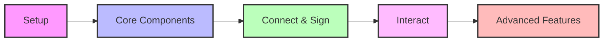
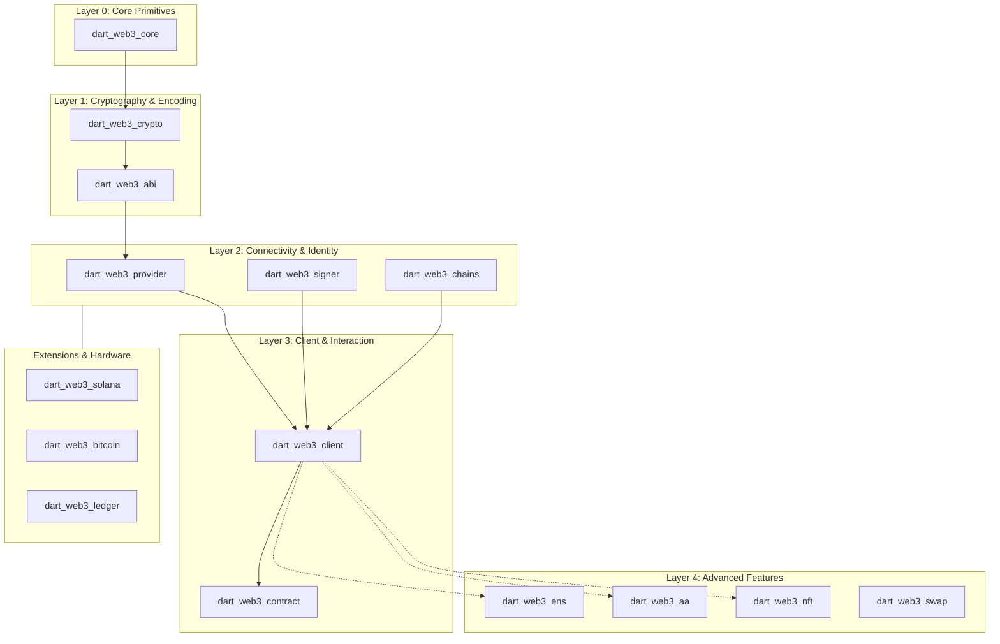

# Dart Web3 SDK

A comprehensive, pure Dart Web3 SDK for EVM-compatible blockchains and multi-chain support.

## Features

- **Pure Dart Implementation** - No native dependencies (FFI, C++, Rust bindings), works on all Dart/Flutter platforms
- **Modular Architecture** - Import only what you need, each package is independently usable
- **Multi-Chain Support** - Core EVM support with extensions for Solana, Polkadot, Tron, TON, and Bitcoin
- **Hardware Wallets** - Built-in support for Ledger, Trezor, Keystone, and various MPC solutions
- **Type-Safe** - Leverages Dart's type system for compile-time error checking
- **Modern Standards** - Supports EIP-1559, EIP-4844 (Blob), EIP-7702, ERC-4337 (Account Abstraction)

## Installation

Add the packages you need to your `pubspec.yaml`:

```yaml
dependencies:
  # Core functionality
  dart_web3_core: ^0.1.0
  dart_web3_crypto: ^0.1.0
  dart_web3_abi: ^0.1.0
  
  # Client and provider
  dart_web3_provider: ^0.1.0
  dart_web3_client: ^0.1.0
  
  # Or use the meta-package for everything
  dart_web3: ^0.1.0
```

## Usage Workflow



## Quick Start

### 1. Basic RPC Operations
```dart
import 'package:dart_web3/dart_web3.dart';

void main() async {
  final client = ClientFactory.createPublicClient(
    rpcUrl: 'https://eth.llamarpc.com',
    chain: Chains.ethereum,
  );
  
  final blockNumber = await client.getBlockNumber();
  print('Current Block: $blockNumber');
}
```

### 2. Contract Interaction (ERC-20)
```dart
import 'package:dart_web3/dart_web3.dart';

void main() async {
  final client = ClientFactory.createPublicClient(rpcUrl: '...');
  final contract = ERC20(address: '0x...', client: client);

  final symbol = await contract.symbol();
  final balance = await contract.balanceOf('0x...');
  print('$symbol Balance: ${EthUnit.formatEther(balance)}');
}
```

### 3. Batch Calls (Multicall)
```dart
import 'package:dart_web3/dart_web3.dart';

void main() async {
  final client = ClientFactory.createPublicClient(rpcUrl: '...');
  final multicall = Multicall(client: client);

  final results = await multicall.aggregate([
    contract.getBalanceRequest('0xUser1'),
    contract.getBalanceRequest('0xUser2'),
    client.getEthBalanceRequest('0xUser1'),
  ]);
}
```

### 4. Account Abstraction (ERC-4337)
```dart
import 'package:dart_web3/dart_web3.dart';

void main() async {
  final signer = PrivateKeySigner.fromHex('0x...');
  final smartAccount = await SimpleSmartAccount.create(
    signer: signer,
    rpcUrl: '...',
    entryPoint: '0x...',
  );

  final txHash = await smartAccount.sendTransaction(
    to: '0x...',
    value: EthUnit.ether('0.01'),
  );
}
```

### 5. Multi-Chain Extensions
```dart
import 'package:dart_web3/dart_web3.dart';
import 'package:dart_web3_solana/dart_web3_solana.dart';

void main() async {
  // Use Ethereum core for EVM
  final evmBalance = await evmClient.getBalance('0x...');

  // Use Solana extension for non-EVM
  final solClient = SolanaClient(endpoint: '...');
  final solBalance = await solClient.getBalance('...');
}
```

## Examples

We provide a variety of examples to help you get started with the SDK:

| Example | Description |
|---------|-------------|
| [Connectivity](dart_web3/example/connectivity.dart) | Check connectivity across multiple networks |
| [Wallet Management](dart_web3/example/wallet_overview.dart) | HD Wallet derivation, mnemonic generation, and signing |
| [Token Interactions](dart_web3/example/token_interactions.dart) | Reading ERC-20 metadata and balances |
| [Account Abstraction](dart_web3/example/account_abstraction_basic.dart) | ERC-4337 Smart Account setup and UserOps |

Find more details in the [Usage Guide](dart_web3/USAGE_GUIDE.md).

## Architecture Blueprint



## Package Structure

## 📦 Modules & Capabilities

The SDK is divided into specialized layers. Click on a package to see its dedicated documentation.

### **Layer 0-1: Foundation** (The "Trust Wallet Core" equivalent)
Low-level primitives for cryptography, encoding, and data models.
- **[`dart_web3_core`](dart_web3/packages/core)**: Essential types (`EthAddress`, `BigInt` units), RLP encoding, and byte manipulation.
- **[`dart_web3_crypto`](dart_web3/packages/crypto)**: Security-first crypto engine. `secp256k1`, `BIP-39` mnemonics, `BIP-44` HD Wallets, and `Keccak` hashing.
- **[`dart_web3_abi`](dart_web3/packages/abi)**: Robust ABI v2 codec for encoding/decoding Solidity types, functions, and events.

### **Layer 2: Connectivity & Identity**
Standardized interfaces for connecting to blockchains and managing identities.
- **[`dart_web3_provider`](dart_web3/packages/provider)**: JSON-RPC 2.0 gateway supporting HTTP and WebSockets with middleware support.
- **[`dart_web3_signer`](dart_web3/packages/signer)**: Universal signing abstraction for Private Keys, Passkeys, and Hardware Wallets (Ledger/Trezor).
- **[`dart_web3_chains`](dart_web3/packages/chains)**: Comprehensive registry of EVM networks (metadata, RPCs, contract addresses).

### **Layer 3: Interaction**
The primary developer surface for building DApps.
- **[`dart_web3_client`](dart_web3/packages/client)**: High-level `PublicClient` and `WalletClient` for composable blockchain interaction.
- **[`dart_web3_contract`](dart_web3/packages/contract)**: Type-safe wrapper for smart contracts (read state, write transactions, watch events).
- **[`dart_web3_events`](dart_web3/packages/events)**: Recursive event filter polling and WebSocket subscription management.

### **Layer 4-5: Advanced Features**
Specialized modules for complex Web3 workflows.
- **[`dart_web3_aa`](dart_web3/packages/aa)**: **Account Abstraction** (ERC-4337) toolkit. Smart Accounts, Bundlers, and Paymasters.
- **[`dart_web3_ens`](dart_web3/packages/ens)**: Ethereum Name Service resolution and avatar fetching.
- **[`dart_web3_multicall`](dart_web3/packages/multicall)**: Batch aggregate on-chain calls into a single RPC request.
- **[`dart_web3_reown`](dart_web3/packages/reown)**: WalletConnect v2 integration (formerly Reown).
- **[`dart_web3_nft`](dart_web3/packages/nft)**: Metadata fetching and standard interfaces for ERC-721/ERC-1155.
- **[`dart_web3_swap`](dart_web3/packages/swap)**: DEX aggregation interfaces and utilities.
- **[`dart_web3_bridge`](dart_web3/packages/bridge)**: Cross-chain bridging utilities.
- **[`dart_web3_debug`](dart_web3/packages/debug)**: Trace API and debugging tools.
- **[`dart_web3_mev`](dart_web3/packages/mev)**: MEV bundle submission and protections.

### **Layer 6: Hardware Security**
Air-gapped and secure-element integration.
- **[`dart_web3_ledger`](dart_web3/packages/hardware/ledger)**: Connect via USB/BLE to Ledger Nano S/X/Stax.
- **[`dart_web3_trezor`](dart_web3/packages/hardware/trezor)**: Connect via USB Bridge to Trezor One/T/Safe.
- **[`dart_web3_keystone`](dart_web3/packages/hardware/keystone)**: Air-gapped QR communication with Keystone devices.
- **[`dart_web3_bc_ur`](dart_web3/packages/hardware/bc_ur)**: Blockchain Uniform Resource (BC-UR) protocol for QR code transmission.

### **Layer 7: Multi-Chain Extensions**
Beyond the EVM. Native support for other major blockchains.
- **[`dart_web3_solana`](dart_web3/packages/extensions/solana)**: Solana SVM support (SPL tokens, Programs, PDAs).
- **[`dart_web3_bitcoin`](dart_web3/packages/extensions/bitcoin)**: Bitcoin UTXO management, SegWit, and PSBTs.
- **[`dart_web3_polkadot`](dart_web3/packages/extensions/polkadot)**: Substrate/Polkadot support with SCALE codec.
- **[`dart_web3_tron`](dart_web3/packages/extensions/tron)**: TRON network support (TRC-20, Bandwidth/Energy).
- **[`dart_web3_ton`](dart_web3/packages/extensions/ton)**: The Open Network (TON) support (Bag of Cells, Jettons).

## Development

This project uses [Melos](https://melos.invertase.dev/) for monorepo management.

```bash
# Install melos globally
dart pub global activate melos

# Bootstrap the workspace
melos bootstrap

# Run tests
melos test

# Run analysis
melos analyze
```

## License

MIT License - see [LICENSE](LICENSE) for details.

## References

This SDK is inspired by and references:
- [viem](https://viem.sh/) - Modern TypeScript EVM library
- [ethers.js](https://ethers.org/) - Classic TypeScript EVM library
- [alloy](https://alloy.rs/) - Rust Ethereum SDK
- [blockchain_utils](https://github.com/mrtnetwork/blockchain_utils) - Pure Dart crypto utilities
- [on_chain](https://github.com/mrtnetwork/on_chain) - Multi-chain Dart library
