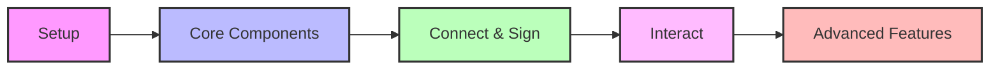
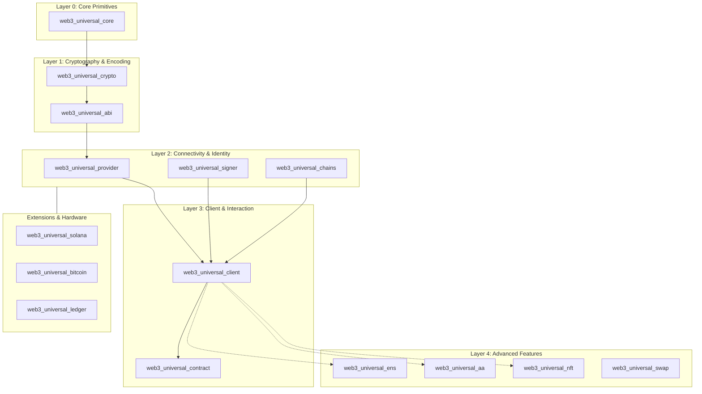

# Dart Web3 SDK

A comprehensive, pure Dart Web3 SDK for EVM-compatible blockchains and multi-chain support.

## Features

- **Pure Dart Implementation** - No native dependencies (FFI, C++, Rust bindings), works on all Dart/Flutter platforms
- **Modular Architecture** - Import only what you need, each package is independently usable
- **Multi-Chain Support** - Core EVM support with extensions for Solana, Polkadot, Tron, TON, and Bitcoin
- **Hardware Wallets** - Built-in support for Ledger, Trezor, Keystone, and various MPC solutions
- **Type-Safe** - Leverages Dart's type system for compile-time error checking
- **Modern Standards** - Supports EIP-1559, EIP-4844 (Blob), EIP-7702, ERC-4337 (Account Abstraction)

## Installation

Add the packages you need to your `pubspec.yaml`:

```yaml
dependencies:
  # Core functionality
  web3_universal_core: ^0.1.0
  web3_universal_crypto: ^0.2.0
  web3_universal_abi: ^0.1.0
  dart_web3_compat: ^0.1.0
  
  # Client and provider
  web3_universal_provider: ^0.1.0
  web3_universal_client: ^0.1.0
```

## Usage Workflow



## Quick Start

```dart
import 'package:web3_universal_client/web3_universal_client.dart';
import 'package:web3_universal_chains/web3_universal_chains.dart';
import 'package:web3_universal_signer/web3_universal_signer.dart';

void main() async {
  // Create a public client for read-only operations
  final publicClient = ClientFactory.createPublicClient(
    rpcUrl: 'https://eth.llamarpc.com',
    chain: Chains.ethereum,
  );
  
  // Get balance
  final balance = await publicClient.getBalance('0x...');
  print('Balance: ${EthUnit.formatEther(balance)} ETH');
  
  // Create a wallet client for transactions
  final signer = PrivateKeySigner.fromHex('0x...', Chains.ethereum.chainId);
  final walletClient = ClientFactory.createWalletClient(
    rpcUrl: 'https://eth.llamarpc.com',
    chain: Chains.ethereum,
    signer: signer,
  );
  
  // Send transaction
  final txHash = await walletClient.transfer(
    '0xRecipient...',
    EthUnit.ether('0.1'),
  );
  print('Transaction: $txHash');
}
```

## Examples

We provide a variety of examples to help you get started with the SDK:

| Example | Description |
|---------|-------------|
| [Connectivity](example/connectivity.dart) | Check connectivity across multiple networks |
| [Wallet Management](example/wallet_overview.dart) | HD Wallet derivation, mnemonic generation, and signing |
| [Token Interactions](example/token_interactions.dart) | Reading ERC-20 metadata and balances |
| [Account Abstraction](example/account_abstraction_basic.dart) | ERC-4337 Smart Account setup and UserOps |

Find more details in the [Usage Guide](USAGE_GUIDE.md).

## Architecture Blueprint



## Package Structure

| Package | Status | Description | Level |
|---------|--------|-------------|-------|
| [`web3_universal_core`](packages/core) | [](https://pub.dev/packages/web3_universal_core) | Core utilities (address, BigInt, encoding, RLP) | 0 |
| [`web3_universal_crypto`](packages/crypto) | [](https://pub.dev/packages/web3_universal_crypto) | Cryptography (keccak, Scrypt, Keystore V3, BIP-32/39/44) | 1 |
| [`web3_universal_abi`](packages/abi) | [](https://pub.dev/packages/web3_universal_abi) | ABI encoding/decoding | 1 |
| [`dart_web3_compat`](packages/compat) | | web3dart compatibility layer (drop-in replacement) | 1 |
| [`web3_universal_provider`](packages/provider) | [](https://pub.dev/packages/web3_universal_provider) | RPC Provider (HTTP/WebSocket) | 2 |
| [`web3_universal_signer`](packages/signer) | [](https://pub.dev/packages/web3_universal_signer) | Signer abstraction | 2 |
| [`web3_universal_chains`](packages/chains) | [](https://pub.dev/packages/web3_universal_chains) | Chain configurations | 2 |
| [`web3_universal_client`](packages/client) | | PublicClient/WalletClient | 3 |
| [`web3_universal_contract`](packages/contract) | | Contract abstraction | 3 |
| [`web3_universal_events`](packages/events) | | Event subscription | 3 |
| [`web3_universal_multicall`](packages/multicall) | | Multicall support | 4 |
| [`web3_universal_ens`](packages/ens) | | ENS resolution | 4 |
| [`web3_universal_aa`](packages/aa) | | ERC-4337 Account Abstraction | 5 |
| [`web3_universal_reown`](packages/reown) | [](https://pub.dev/packages/web3_universal_reown) | Reown/WalletConnect v2 | 5 |
| [`web3_universal_swap`](packages/swap) | | DEX aggregation | 5 |
| [`web3_universal_bridge`](packages/bridge) | | Cross-chain bridging | 5 |
| [`web3_universal_nft`](packages/nft) | [](https://pub.dev/packages/web3_universal_nft) | NFT services | 5 |
| [`web3_universal_staking`](packages/staking) | | Staking services | 5 |
| [`web3_universal_debug`](packages/debug) | [](https://pub.dev/packages/web3_universal_debug) | Debug/Trace API | 5 |
| [`web3_universal_mev`](packages/mev) | [](https://pub.dev/packages/web3_universal_mev) | MEV protection/Flashbots | 5 |
| [`web3_universal_dapp`](packages/dapp) | [](https://pub.dev/packages/web3_universal_dapp) | DApp state & session management | 5 |
| [`web3_universal_history`](packages/history) | | Transaction history explorer | 5 |
| [`web3_universal_price`](packages/price) | [](https://pub.dev/packages/web3_universal_price) | Asset pricing and oracles | 5 |
| [`web3_universal_bc_ur`](packages/hardware/bc_ur) | [](https://pub.dev/packages/web3_universal_bc_ur) | BC-UR air-gapped protocol | 6 |
| [`web3_universal_keystone`](packages/hardware/keystone) | [](https://pub.dev/packages/web3_universal_keystone) | Keystone hardware wallet | 6 |
| [`web3_universal_ledger`](packages/hardware/ledger) | [](https://pub.dev/packages/web3_universal_ledger) | Ledger hardware wallet | 6 |
| [`web3_universal_trezor`](packages/hardware/trezor) | [](https://pub.dev/packages/web3_universal_trezor) | Trezor hardware wallet | 6 |
| [`web3_universal_mpc`](packages/hardware/mpc) | [](https://pub.dev/packages/web3_universal_mpc) | MPC wallet support | 6 |
| [`web3_universal_solana`](packages/extensions/solana) | [](https://pub.dev/packages/web3_universal_solana) | Solana extension | 7 |
| [`web3_universal_polkadot`](packages/extensions/polkadot) | [](https://pub.dev/packages/web3_universal_polkadot) | Polkadot extension | 7 |
| [`web3_universal_tron`](packages/extensions/tron) | [](https://pub.dev/packages/web3_universal_tron) | Tron extension | 7 |
| [`web3_universal_ton`](packages/extensions/ton) | [](https://pub.dev/packages/web3_universal_ton) | TON extension | 7 |
| [`web3_universal_bitcoin`](packages/extensions/bitcoin) | [](https://pub.dev/packages/web3_universal_bitcoin) | Bitcoin extension | 7 |

## Development

This project uses [Melos](https://melos.invertase.dev/) for monorepo management.

```bash
# Install melos globally
dart pub global activate melos

# Bootstrap the workspace
melos bootstrap

# Run tests
melos test

# Run analysis
melos analyze
```

## License

MIT License - see [LICENSE](LICENSE) for details.

## References

This SDK is inspired by and references:
- [viem](https://viem.sh/) - Modern TypeScript EVM library
- [ethers.js](https://ethers.org/) - Classic TypeScript EVM library
- [alloy](https://alloy.rs/) - Rust Ethereum SDK
- [blockchain_utils](https://github.com/mrtnetwork/blockchain_utils) - Pure Dart crypto utilities
- [on_chain](https://github.com/mrtnetwork/on_chain) - Multi-chain Dart library
