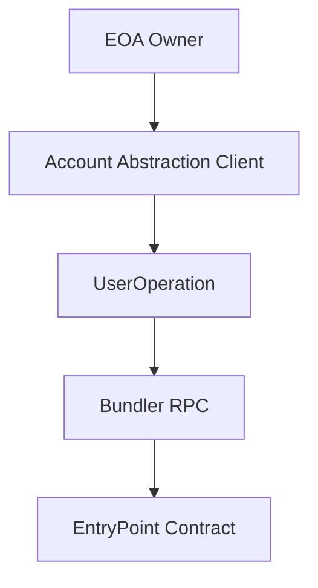

# dart_web3_aa

Production-ready ERC-4337 Account Abstraction for Dart and Flutter.

## Features

- **Smart Account Management**: Base classes for SimpleAccount, Safe, and Kernel.
- **UserOperation Factory**: Easy construction and signing of UserOperations.
- **Bundler Integration**: Fully compatible with popular bundlers (Stackup, Alchemy, Pimlico).
- **Paymaster Support**: Support for gas sponsorship and ERC-20 gas payments.
- **Counterfactuals**: Deterministic address calculation before account deployment.

## Architecture



## Usage

```dart
import 'package:dart_web3_aa/dart_web3_aa.dart';

void main() async {
  final smartAccount = SimpleAccount(
    owner: mySigner,
    factoryAddress: '0x...',
  );
  
  print('Smart Account Address: ${smartAccount.address}');
}
```

## Installation

```yaml
dependencies:
  dart_web3_aa: ^0.1.0
```
