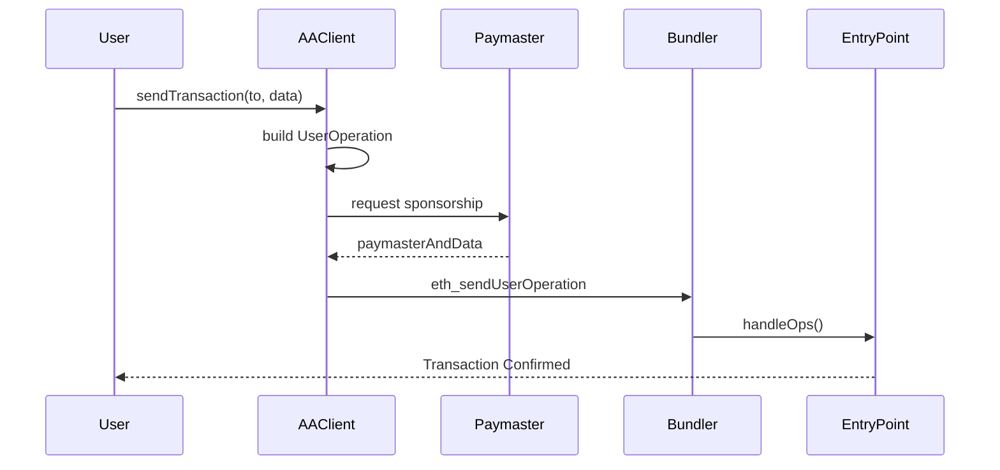
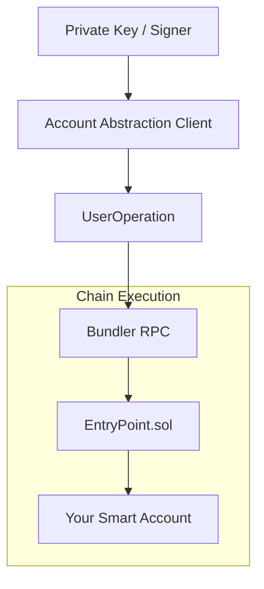

# dart_web3_aa

<!-- Package not yet published to pub.dev -->
[](https://opensource.org/licenses/MIT)

A **production-ready Account Abstraction (AA) toolkit** for Dart. It enables the implementation of ERC-4337 smart accounts, gas sponsorship, and custom validation logic in mobile and web applications.

## 🚀 Features

- **Standard Smart Accounts**: Built-in support for SimpleAccount, Safe (Gnosis), and Kernel accounts.
- **UserOperation Factory**: Automatic construction, estimation, and signing of UserOps.
- **Paymaster Integration**: Seamless hooks for Verifying Paymasters (sponsorship) and ERC-20 Paymasters.
- **Bundler Compatibility**: Standardized JSON-RPC interface for all major bundler providers (Stackup, Pimlico, Alchemy).

## Usage Flow


## 🏗️ Architecture



## 📚 Technical Reference

### Core Classes
| Class | Responsibility |
|-------|----------------|
| `AAClient` | High-level client for sending transactions as a Smart Account. |
| `UserOperation` | Data structure representing an ERC-4337 intent. |
| `Paymaster` | Interface for interacting with sponsorship services. |
| `SimpleAccount` | Default logic for EOA-controlled smart accounts. |

## 🛡️ Security Considerations

- **Private Key Isolation**: The UserOp signer should never be exposed. If using a Browser/Mobile EOA as the signer, ensure the `AAClient` uses secure signing hooks.
- **EntryPoint Trust**: Only interact with official EntryPoint deployments (e.g., `0x5FF137D4b0FDCD49DcA30c7CF57E578a026d2789`).
- **Paymaster Data**: Strictly validate Paymaster metadata to prevent "Gas Griefing" where a malicious paymaster could cause your UserOps to fail consistently.

## 💻 Usage

### Sending a Sponsored Transaction
```dart
import 'package:dart_web3_aa/dart_web3_aa.dart';

void main() async {
  final smartAccount = SimpleAccount(owner: mySigner);
  final client = AAClient(smartAccount: smartAccount, bundlerUrl: '...');

  // Use a paymaster to sponsor gas
  client.setPaymaster(StackupPaymaster(apiKey: '...'));

  final userOpHash = await client.sendTransaction(
    to: '0x...',
    value: BigInt.from(0),
    data: contractCallData,
  );
  
  print('UserOp Hash: $userOpHash');
}
```

## 📦 Installation

```yaml
dependencies:
  dart_web3_aa: ^0.1.0
```
