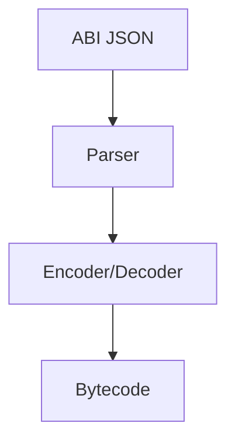
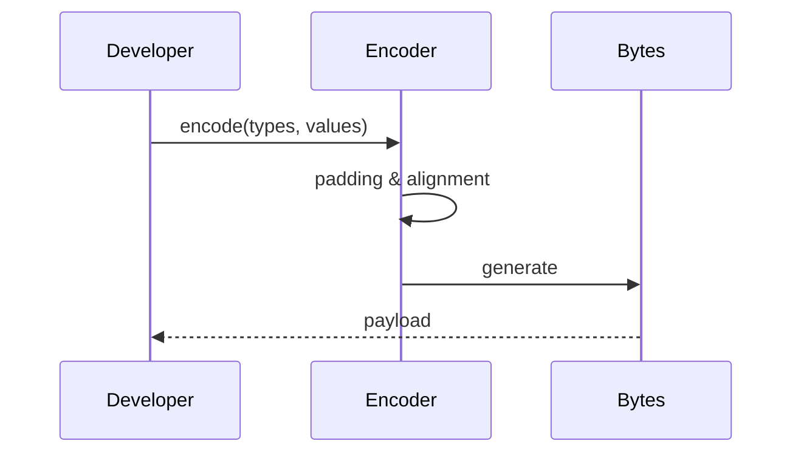
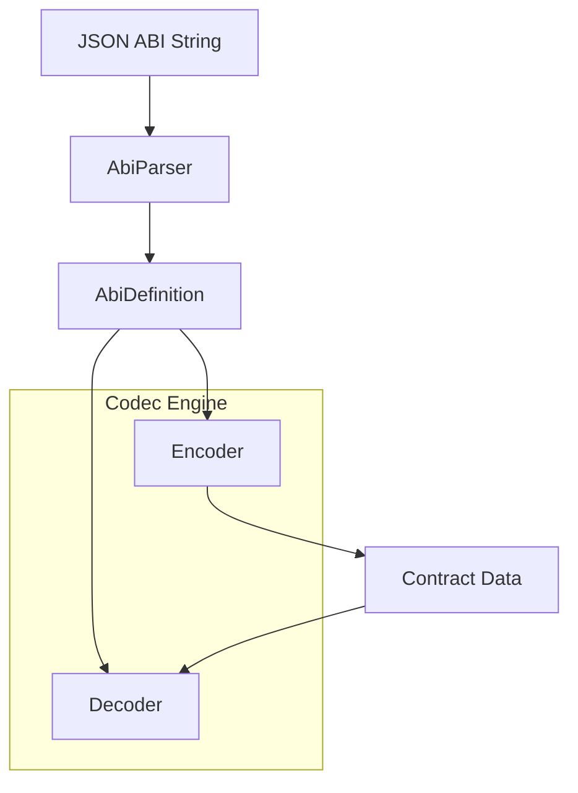

# dart_web3_abi

<!-- Package not yet published to pub.dev -->
[](https://opensource.org/licenses/MIT)

A **type-safe ABI codec** for Ethereum contract interaction. Encodes and decodes Solidity types with precision and full compliance with the Ethereum ABI specification.

## 🚀 Features

- **Full Type Support**: Handles `uint8-256`, `int8-256`, `address`, `bool`, `bytes1-32`, and `string`.
- **Dynamic Arrays**: Support for variable length types and complex nested arrays.
- **ABI v2 (Tuples)**: Full recursive support for structs and nested tuple objects.
- **Event Logs**: Specialized decoders for indexing and parsing block log topics.

## Usage Flow


## Encoding Flow


## 🏗️ Architecture



## 📚 Technical Reference

### Core Classes
| Class | Responsibility |
|-------|----------------|
| `AbiFunction` | Logic for encoding method selector and parameters. |
| `AbiEvent` | Logic for parsing log topics and data into objects. |
| `ContractAbi` | A container for all functions and events in a smart contract. |
| `AbiType` | Abstract base for individual codec logic (UintType, AddressType, etc.). |

## 🛡️ Security Considerations

- **Overflow Validation**: The encoder checks if provided values fit within the specific bit-width (e.g., `uint8`). Always handle the `ArgumentError` if your data sources are untrusted.
- **Selector Collisions**: Be aware that different function signatures can result in the same 4-byte selector. The SDK strictly validates against the Provided ABI.
- **Malformed Inputs**: The decoder uses safe-padding checks to prevent buffer overflow attacks from malicious RPC responses.

## 💻 Usage

### Decoding Event Logs
```dart
import 'package:dart_web3_abi/dart_web3_abi.dart';

void main() {
  final transferEvent = AbiEvent(
    name: 'Transfer',
    params: [
      AbiParameter('from', 'address', indexed: true),
      AbiParameter('to', 'address', indexed: true),
      AbiParameter('value', 'uint256', indexed: false),
    ],
  );

  final decoded = transferEvent.decode(
    topics: ['0x...', '0x...', '0x...'],
    data: '0x0000000000000000000000000000000000000000000000000000000005f5e100',
  );
  
  print('Value: ${decoded['value']}');
}
```

## 📦 Installation

```yaml
dependencies:
  dart_web3_abi: ^0.1.0
```
