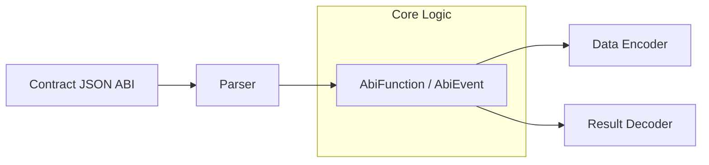

# dart_web3_abi

Ethereum Application Binary Interface (ABI) encoding and decoding.

## Features

- **Type Encoding**: Strict adherence to the Ethereum ABI specification for all Solidity types.
- **Dynamic & Static Types**: Support for `bytes`, `string`, `uint[]`, and fixed-size arrays.
- **Tuples/Structs**: Recursive encoding/decoding of nested tuples (v2 ABI).
- **Function Call Encoding**: Easily construct `data` fields for transactions.
- **Event Parsing**: Decode log data and topics into structured Dart objects.

## Architecture



## Usage

### Encoding a Function Call
```dart
import 'package:dart_web3_abi/dart_web3_abi.dart';

void main() {
  final transferFunction = AbiFunction(
    name: 'transfer',
    params: [
      AbiParameter('to', 'address'),
      AbiParameter('value', 'uint256'),
    ],
  );

  final encoded = transferFunction.encode([
    '0x32Be343B94f860124dC4fEe278FDCBD38C102D88',
    BigInt.from(1000000000),
  ]);
  
  print('Calldata: 0x${encoded.toHex()}');
}
```

## Installation

```yaml
dependencies:
  dart_web3_abi: ^0.1.0
```
