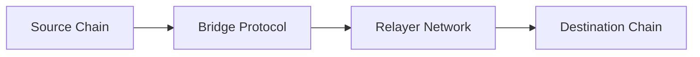

# dart_web3_bridge

Cross-chain liquidity and messaging integration.

## Features

- **Bridge Connectivity**: Support for Hop, Stargate, and Across protocols.
- **Transaction Tracking**: Long-polling and event-based tracking of cross-chain status.
- **Fee Calculation**: Estimating destination gas and relayer fees.
- **Call-Data Construction**: Helpers for calling bridge-specific smart contract methods.

## Architecture



## Usage

```dart
import 'package:dart_web3_bridge/dart_web3_bridge.dart';

void main() {
  final hop = HopBridge(client: myClient);
  
  // Prepare a cross-chain transfer
  final transfer = hop.prepareTransfer(
    toChain: Chains.polygon,
    asset: TokenInfo.USDC,
    amount: BigInt.from(1000000),
  );
}
```

## Installation

```yaml
dependencies:
  dart_web3_bridge: ^0.1.0
```
