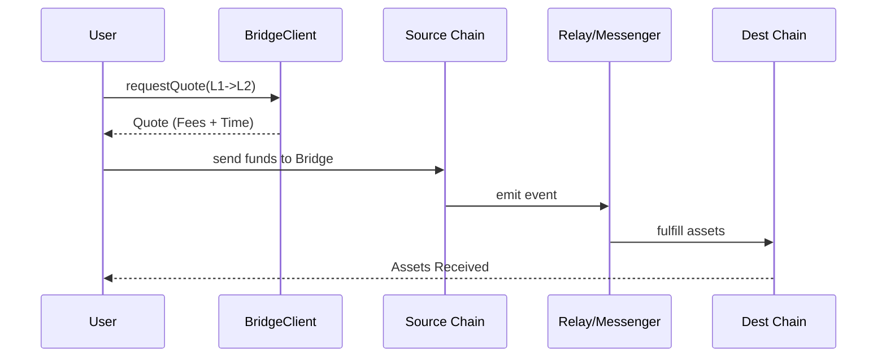
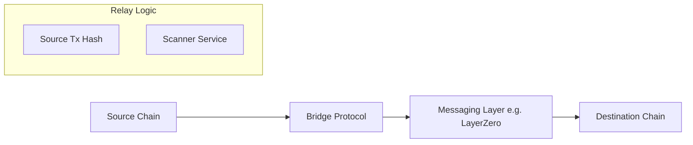

# dart_web3_bridge

[](https://pub.dev/packages/dart_web3_bridge)
[](https://opensource.org/licenses/MIT)

A **cross-chain interoperability wrapper** for the Dart Web3 ecosystem. Effortlessly move assets between Layer 1s, Layer 2s, and sidechains using a standardized interface.

## 🚀 Features

- **Multi-Bridge Support**: Native integration for Stargate, Layerswap, Hop, and Celer.
- **Status Monitoring**: Real-time tracking of cross-chain status (Initiated, Pending, Completed).
- **L2 Optimized**: Low-latency route discovery for Ethereum rollups (Base, Arbitrum, Optimism).
- **Security Scopes**: Built-in verification of destination chain IDs and asset compatibility.

## Usage Flow


## 🏗️ Architecture



## 📚 Technical Reference

### Core Classes
| Class | Responsibility |
|-------|----------------|
| `BridgeClient` | Orchestrates cross-chain quotes and execution. |
| `BridgeQuote` | Details about fees, estimated time, and route path. |
| `RouteScanner` | Backend service that monitors destination confirmation. |
| `BridgeProvider` | Interface for specific protocols (e.g., StargateProvider). |

## 🛡️ Security Considerations

- **Bridge Vulnerabilities**: Bridge protocols are high-risk targets. Regularly update the SDK to ensure you are using the latest, patched versions of protocol adapters.
- **Slippage on Dest**: If the bridge performs an internal swap on the destination chain, ensure you set a cautious `minReceived` amount.
- **Address Mistypes**: Always double-check that the destination address is valid for the *target network type* (especially when bridging between EVM and Non-EVM).

## 💻 Usage

### Initiating an L2 to L2 Transfer
```dart
import 'package:dart_web3_bridge/dart_web3_bridge.dart';

void main() async {
  final bridge = BridgeClient(providers: [HopProvider()]);

  final quote = await bridge.getQuote(
    fromChain: Chains.arbitrum,
    toChain: Chains.optimism,
    asset: 'ETH',
    amount: EthUnit.ether('0.5'),
  );

  print('Fee: ${quote.fee}');
  print('Est. Time: ${quote.estimatedMinutes} min');

  final txHash = await bridge.execute(quote, signer: mySigner);
}
```

## 📦 Installation

```yaml
dependencies:
  dart_web3_bridge: ^0.1.0
```
