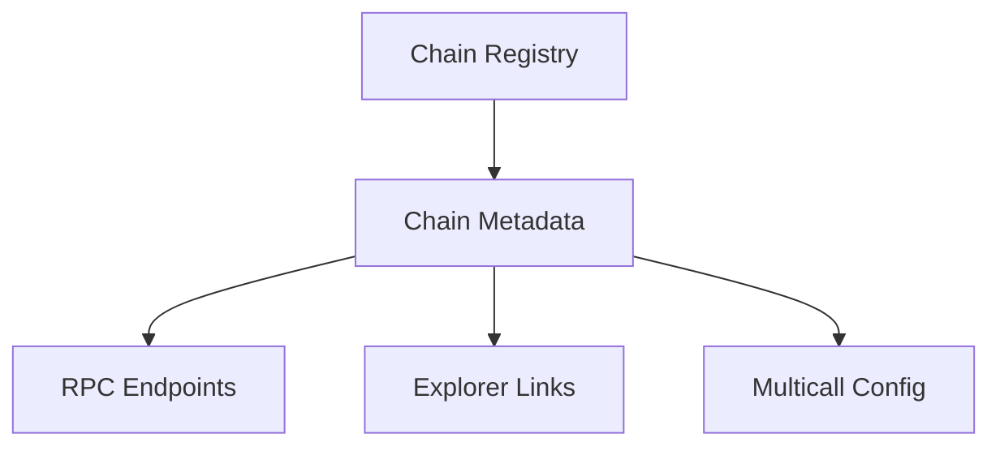

# dart_web3_chains

Comprehensive registry and configuration for EVM-compatible networks.

## Features

- **Pre-configured Networks**: One-click access to Ethereum, Polygon, Arbitrum, Optimism, Base, and more.
- **Metric Definitions**: Native currency symbols, decimals, and block explorer URLs.
- **Multicall Registry**: Default addresses for Multicall3 contracts across supported chains.
- **Custom Chains**: Easily define and use any EVM network not in the registry.

## Architecture



## Usage

### Using Predefined Chains
```dart
import 'package:dart_web3_chains/dart_web3_chains.dart';

void main() {
  final chain = Chains.polygon;
  print('Network: ${chain.name}');
  print('Main RPC: ${chain.rpcUrls.first}');
}
```

## Installation

```yaml
dependencies:
  dart_web3_chains: ^0.1.0
```
