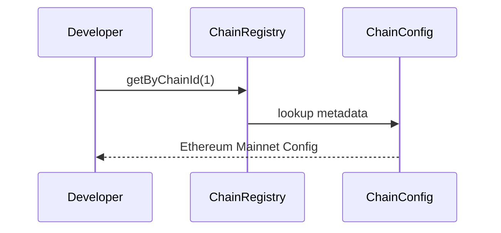
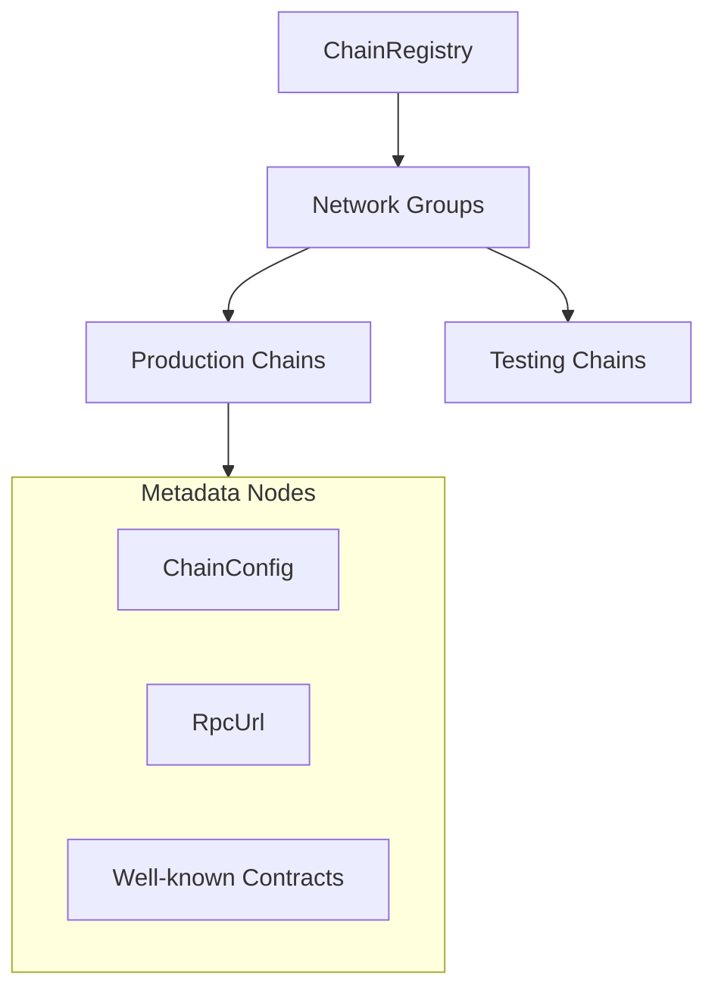

# dart_web3_chains

<!-- Package not yet published to pub.dev -->
[](https://opensource.org/licenses/MIT)

A **comprehensive network registry** for EVM-compatible blockchains. This package provides metadata, RPC configurations, and contract addresses for dozens of networks.

## 🚀 Features

- **Standardized Metadata**: Access chain IDs, currency symbols, and explorer URLs.
- **Multi-Chain Support**: Pre-configured data for Ethereum, Polygon, BSC, Avalanche, Base, etc.
- **Advanced Features Settings**: Built-in flags for EIP-1559 and Blob support per network.
- **Customizable**: Create and register custom private or devnet configurations effortlessly.

## Usage Flow


## 🏗️ Architecture



## 📚 Technical Reference

### Core Classes
| Class | Responsibility |
|-------|----------------|
| `Chain` | The primary object containing all metadata for a network. |
| `Chains` | A static collection of production-ready chain configurations. |
| `Currency` | Describes native tokens (name, symbol, decimals). |
40: | `BlockExplorer` | Configuration for standard explorer URL structures. |

## 🛡️ Security Considerations

- **ChainID Validation**: Always verify the `chainId` returned by the RPC matches the `ChainConfig` to prevent replay attacks on unintended networks.
- **RPC Privacy**: Use the `rpcUrls` provided as a starting point, but encourage users to provide their own private RPC keys for production apps to avoid rate limiting and metadata tracking.

## 💻 Usage

### Querying Network Metadata
```dart
import 'package:dart_web3_chains/dart_web3_chains.dart';

void main() {
  final chain = Chains.arbitrum;
  
  print('Network: ${chain.name}');
  print('Native Asset: ${chain.nativeCurrency.symbol}');
  print('Supports EIP-1559: ${chain.features.supportsEIP1559}');
}
```

## 📦 Installation

```yaml
dependencies:
  dart_web3_chains: ^0.1.0
```
