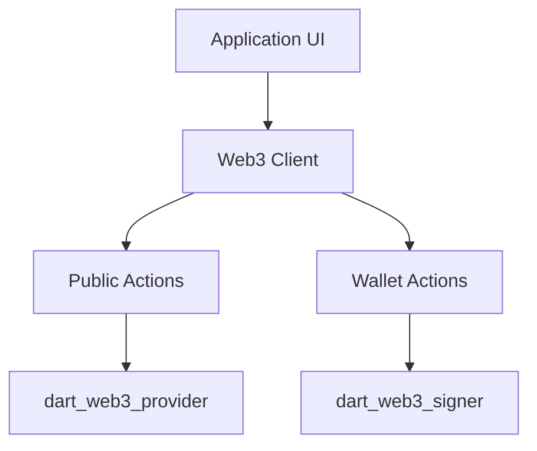

# dart_web3_client

The primary developer entry point for high-level blockchain interaction.

## Features

- **PublicClient**: Optimized for reading state (balances, gas price, call execution).
- **WalletClient**: Optimized for transactional state changes (sending transactions, deploying contracts).
- **Auto-Formatting**: Automatically handles hex padding and unit parsing for common RPC methods.
- **Chain Integration**: Seamlessly works with `dart_web3_chains` for zero-config setup.

## Architecture



## Usage

### Using PublicClient
```dart
import 'package:dart_web3_client/dart_web3_client.dart';
import 'package:dart_web3_chains/dart_web3_chains.dart';

void main() async {
  final client = ClientFactory.createPublicClient(
    rpcUrl: 'https://eth.llamarpc.com',
    chain: Chains.ethereum,
  );
  
  final block = await client.getBlockNumber();
  print('Current Block: $block');
}
```

## Installation

```yaml
dependencies:
  dart_web3_client: ^0.1.0
```
