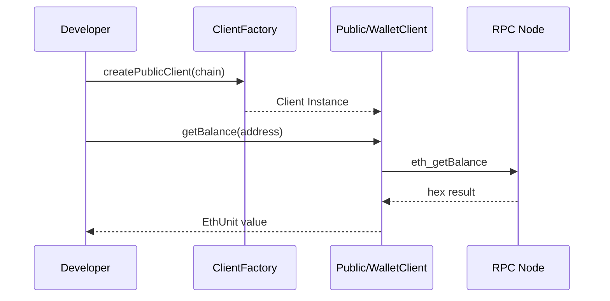
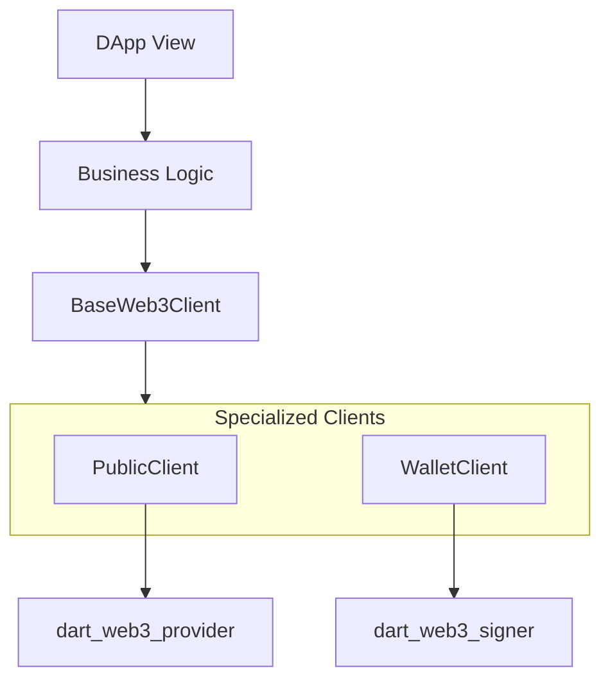

# dart_web3_client

<!-- Package not yet published to pub.dev -->
[](https://opensource.org/licenses/MIT)


The **primary developer interface** for the Dart Web3 SDK. It provides intuitive, high-level abstractions for reading state and executing transactions on any EVM-compatible blockchain.

## 🚀 Features

- **Public & Wallet Clients**: Decoupled clients for read-only vs. authorized write operations.
- **Fluent API**: Modern, async-first methods for common tasks (getBalance, sendTransaction, etc.).
- **Auto-Encoding**: Handles gas Estimation, nonce management, and transaction serialization automatically.
- **Extensible**: Easily add support for custom RPC methods or middleware.

## Usage Flow


## 🏗️ Architecture



## 📚 Technical Reference

### Core Classes
| Class | Responsibility |
|-------|----------------|
| `PublicClient` | Interface for read-only queries from the blockchain. |
| `WalletClient` | Interface for signed actions (sending ETH/Tokens). |
| `ClientFactory` | Utility to quickly create clients for specific chains. |
| `BalanceAction` | Helper for fetching and formatting account balances. |

## 🛡️ Security Considerations

- **Nonce Synchronization**: In high-concurrency environments, manually manage nonces to avoid "nonce too low" errors during rapid transaction bursts.
- **Gas Limit Safety**: While auto-estimation is provided, always set a `MAX_GAS` limit in the client configuration to prevent unintended high cost on complex contract failures.
- **Confirmation Wait**: Always wait for at least 1-2 confirmations (depending on chain speed) before notifying the user of a "Successful" transaction in the UI.

## 💻 Usage

### Professional Transaction Sending
```dart
import 'package:dart_web3_client/dart_web3_client.dart';
import 'package:dart_web3_chains/dart_web3_chains.dart';

void main() async {
  final walletClient = ClientFactory.createWalletClient(
    rpcUrl: 'https://base-mainnet.g.alchemy.com/v2/...',
    chain: Chains.base,
    signer: myPrivateKeySigner,
  );

  try {
    final hash = await walletClient.sendTransaction(
      to: '0x...',
      amount: EthUnit.ether('0.01'),
    );
    print('Pending: $hash');
    
    // Explicitly wait for transaction receipt
    final receipt = await walletClient.waitForTransactionReceipt(hash);
    print('Confirmed in block: ${receipt.blockNumber}');
  } on RpcError catch (e) {
    print('Transaction failed: ${e.message}');
  }
}
```

## 📦 Installation

```yaml
dependencies:
  dart_web3_client: ^0.1.0
```
