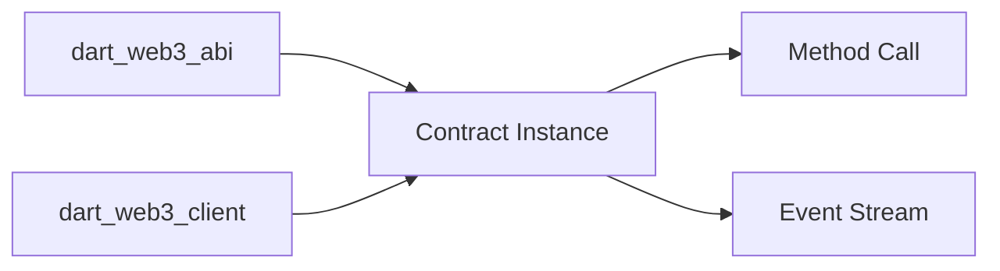

# dart_web3_contract

Type-safe smart contract abstractions for the Dart Web3 SDK.

## Features

- **Contract Instances**: Bind a deployed address to an ABI for intuitive calls.
- **Standard Support**: Out-of-the-box helpers for ERC-20, ERC-721, and ERC-1155.
- **Event Subscriptions**: Type-safe filtering and parsing of contract events.
- **Gas Estimation**: Automatic gas estimation for contract writes.

## Architecture



## Usage

### ERC-20 Example
```dart
import 'package:dart_web3_contract/dart_web3_contract.dart';
import 'package:dart_web3_client/dart_web3_client.dart';

void main() async {
  final usdt = ERC20Contract(
    address: '0x...',
    publicClient: myPublicClient,
  );
  
  final balance = await usdt.balanceOf('0xYourAddress');
  print('USDT Balance: $balance');
}
```

## Installation

```yaml
dependencies:
  dart_web3_contract: ^0.1.0
```
