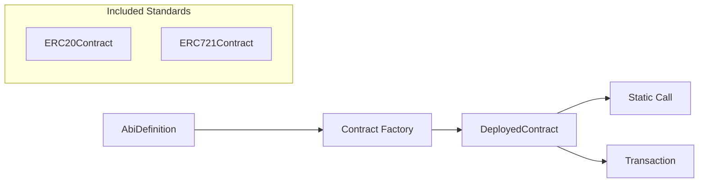

# dart_web3_contract

[](https://pub.dev/packages/web3_universal_contract)
[](https://opensource.org/licenses/MIT)

A **type-safe wrapper** for smart contract interaction. It bridges the gap between raw binary ABI data and developer-friendly Dart objects.

## 🚀 Features

- **Dynamic Contract Bindings**: Create instance objects for any contract using its ABI and Address.
- **Standard Library**: High-level classes for ERC-20, ERC-721, and ERC-1155.
- **Multi-call Optimized**: Methods are designed to be batchable using the `dart_web3_multicall` package.
- **Type Conversion**: Automatic mapping between Solidity types and Dart primitives.

## Usage Flow
```mermaid
graph LR
    A[Contract Address] --> C[DeployedContract Object]
    B[Contract ABI] --> C
    C --> D[Read: call()]
    C --> E[Write: send()]
    D --> F[Parsed Result]
    E --> G[Tx Hash]
```

## 🏗️ Architecture



## 📚 Technical Reference

### Core Classes
| Class | Responsibility |
|-------|----------------|
| `DeployedContract` | The base class for interacting with any generic contract. |
| `ERC20Contract` | Specialized helper for fungible token interactions. |
| `ERC721Contract` | Specialized helper for non-fungible token (NFT) interactions. |
| `ContractFunction` | Represents a single method on a contract instance. |

## 🛡️ Security Considerations

- **Decimal Precision**: In `ERC20Contract`, always check the `decimals()` method result; never assume a token has 18 decimals (e.g., USDC uses 6).
- **Infinite Allowance**: When calling `approve`, consider using specific amounts rather than `uint256.max` unless the UX strictly requires it, to limit potential drain risk.
- **Revert Handling**: Always wrap contract `send` operations in try-catch blocks to handle custom Solidity errors (reverts).

## 💻 Usage

### Managing Token Allowances
```dart
import 'package:dart_web3_contract/dart_web3_contract.dart';

void main() async {
  final dai = ERC20Contract(address: '0x...', publicClient: client);

  // Check current allowance
  final current = await dai.allowance(owner, spender);
  
  if (current < requiredAmount) {
     final tx = await dai.approve(spender, requiredAmount, walletClient: wallet);
     print('Approval sent: $tx');
  }
}
```

## 📦 Installation

```yaml
dependencies:
  dart_web3_contract: ^0.1.0
```
