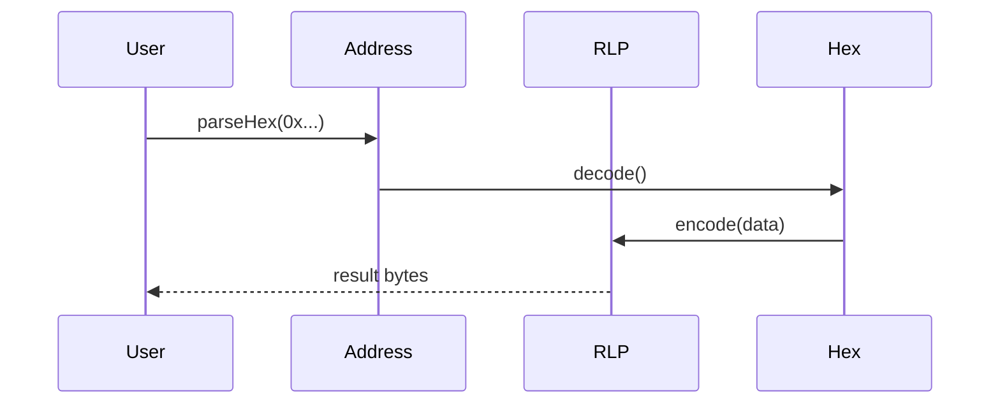
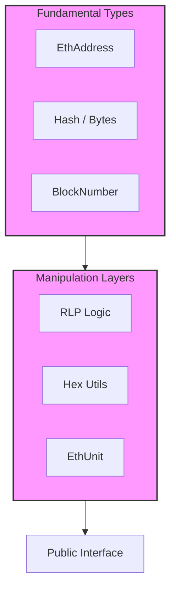

# dart_web3_core

[](https://pub.dev/packages/dart_web3_core)
[](https://opensource.org/licenses/MIT)


The **foundational primitive layer** for the Dart Web3 SDK. This package provides the essential types and utilities required for all blockchain interactions, focusing on performance and cross-platform compatibility.

## 🚀 Features

- **Robust Address Management**: Full support for EIP-55 checksums and ICAP formats.
- **Typed RLP Implementation**: high-performance Recursive Length Prefix encoding for Ethereum data structures.
- **Ether Units**: Type-safe conversions (Wei, Gwei, Ether) with fixed-point accuracy.
- **Byte Manipulation**: Zero-copy friendly extraction and conversion utilities for `Uint8List`.

## Usage Flow


## 🏗️ Architecture



## 📚 Technical Reference

### Core Classes
| Class | Responsibility |
|-------|----------------|
| `EthAddress` | Represents an Ethereum address with checksum validation. |
| `RLP` | Handles serialization of arbitrary data for Ethereum transactions. |
| `EthUnit` | Provides precise big-integer based unit conversions. |
| `HexUtils` | Low-level byte-to-hex and hex-to-byte conversion engine. |

## 🛡️ Security Considerations

- **Address Checksums**: Always use `EthAddress.fromHex(str)` which enforces EIP-55 checksum validation by default.
- **BigInt Safety**: When dealing with 256-bit unsigned integers (Ethereum standard), avoid casting to `double` or `int` to prevent precision loss.
- **Byte Cleansing**: Ensure `Uint8List` buffers containing sensitive data are cleared after use (though Dart GC handles most memory, minimize exposure).

## 💻 Usage

### Precision Unit Conversion
```dart
import 'package:dart_web3_core/dart_web3_core.dart';

void main() {
  // Parsing human input
  final BigInt amountInWei = EthUnit.parseUnit('0.15', 18);
  
  // Formatting for UI
  final String displayValue = EthUnit.formatUnit(amountInWei, 18);
  print('Sending $displayValue ETH');
}
```

### Advanced RLP Encoding
```dart
final encoded = RLP.encode([
  EthAddress.fromHex('0x...').toBytes(),
  BigInt.from(1000),
  [Uint8List.fromList([1, 2, 3])]
]);
```

## 📦 Installation

Add to your `pubspec.yaml`:

```yaml
dependencies:
  dart_web3_core: ^0.1.0
```
