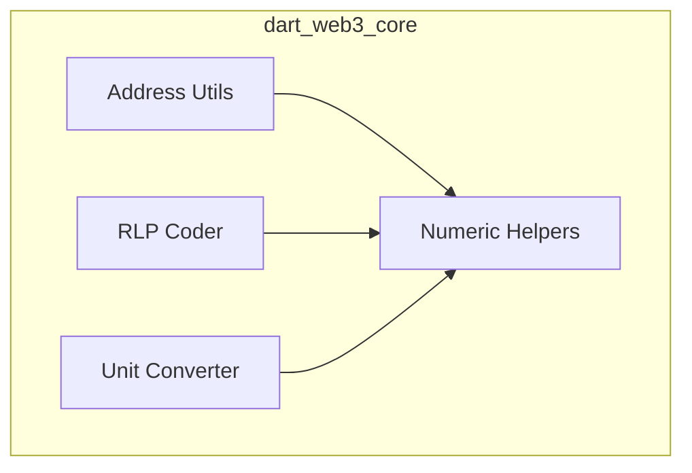

# dart_web3_core

The foundational package for the Dart Web3 SDK, providing core primitives and utilities.

## Features

- **Address Handling**: Robust validation, formatting, and checksum support for Ethereum addresses.
- **RLP Encoding**: Recursive Length Prefix (RLP) implementation for serializing nested arrays of binary data.
- **Numeric Utilities**: High-performance helpers for BigInt, hex strings, and byte array conversions.
- **Unit Conversion**: Accurate Ether unit conversions between Wei, Gwei, and Ether.
- **Internal Types**: Shared domain models used across all `dart_web3` packages.

## Architecture



## Usage

### Address Validation
```dart
import 'package:dart_web3_core/dart_web3_core.dart';

void main() {
  final address = EthAddress.fromHex('0x32Be343B94f860124dC4fEe278FDCBD38C102D88');
  print('Valid checksum: ${address.hex}');
}
```

### Unit Conversion
```dart
final wei = EthUnit.ether('1.5'); // 1.5 ETH to Wei
print(wei); // 1500000000000000000

final eth = EthUnit.formatEther(BigInt.from(1000000000000000000));
print(eth); // "1.0"
```

## Installation

```yaml
dependencies:
  dart_web3_core: ^0.1.0
```
