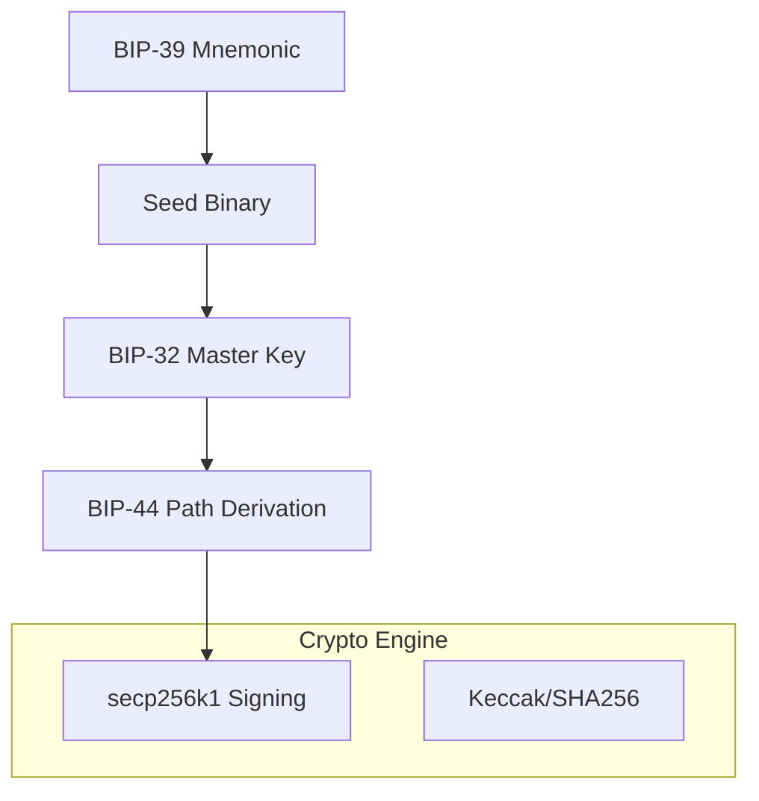

# dart_web3_crypto

Pure Dart cryptographic primitives for the Web3 ecosystem.

## Features

- **Elliptic Curve**: Full support for `secp256k1` (used by Ethereum, Bitcoin).
- **Hardened Key Management**:
    - **BIP-32**: Hierarchical载 Deterministic (HD) Wallets.
    - **BIP-39**: Mnemonic seed phrase generation and entropy management.
    - **BIP-44**: Multi-account derivation paths.
- **Hash Functions**: Optimized implementations of Keccak-256, SHA-256, and RIPEMD-160.
- **ECDSA**: Secure signing and recovery of public keys from signatures.

## Architecture



## Usage

### Mnemonic and HD Wallet
```dart
import 'package:dart_web3_crypto/dart_web3_crypto.dart';

void main() {
  // 1. Generate Mnemonic
  final mnemonic = Mnemonic.generate();
  
  // 2. Create Master Key
  final hdWallet = HDWallet.fromMnemonic(mnemonic);
  
  // 3. Derive Ethereum Path (m/44'/60'/0'/0/0)
  final firstAccount = hdWallet.derivePath("m/44'/60'/0'/0/0");
  print('Private Key: ${firstAccount.privateKey}');
}
```

## Installation

```yaml
dependencies:
  dart_web3_crypto: ^0.1.0
```
