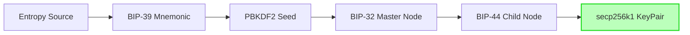

# dart_web3_crypto

[](https://pub.dev/packages/dart_web3_crypto)
[](https://opensource.org/licenses/MIT)


A **security-first** cryptographic engine for the Dart Web3 SDK. This package provides the mathematical backbone for key derivation, signatures, and mnemonic management.

## 🚀 Features

- **Elliptic Curve Engine**: High-performance `secp256k1` implementation in pure Dart.
- **HD Wallet (BIP-32/44)**: Industry-standard hierarchical deterministic derivation for multi-chain support.
- **Mnemonic Seed (BIP-39)**: Secure entropy generation and multilingual wordlist support.
- **Fast Hashing**: Native-optimized Keccak-256 and SHA-256 implementations.

## 🏗️ Architecture



## 📚 Technical Reference

### Core Classes
| Class | Responsibility |
|-------|----------------|
| `Bip39` | Generates and validates mnemonic phrases and seeds. |
| `HDWallet` | Manages node trees and path-based key derivation. |
| `EthKeyPair` | Represents a raw private/public key pair and performs ECDSA. |
| `Keccak` | Provides Ethereum-standard Keccak-256 hashing. |

## 🛡️ Security Considerations

- **Memory Erasure**: Use `privateKey.fill(0)` (if available in buffer context) after deriving keys to minimize resident memory risk.
- **Entropy Source**: `Bip39.generate()` uses `Random.secure()`. On some platforms, ensure the underlying system RNG is properly initialized.
- **Do Not Log Keys**: Never log or print private keys or mnemonics in production. Use obfuscated logging if necessary.

## 💻 Usage

### Secure Multi-Account Derivation
```dart
import 'package:dart_web3_crypto/dart_web3_crypto.dart';

void main() {
  final mnemonic = "asset adjust total... (12 words)";
  final hdRoot = HDWallet.fromMnemonic(Mnemonic.fromSentence(mnemonic, WordList.english));

  // Derive Account #0 and Account #1
  final acc0 = hdRoot.derivePath("m/44'/60'/0'/0/0");
  final acc1 = hdRoot.derivePath("m/44'/60'/0'/0/1");

  print('Acc 0 Address: ${acc0.address}');
}
```

### Performance Hashing
```dart
final hash = Keccak.hash(Uint8List.fromList([0x01, 0x02]));
```

## 📦 Installation

```yaml
dependencies:
  dart_web3_crypto: ^0.1.0
```
