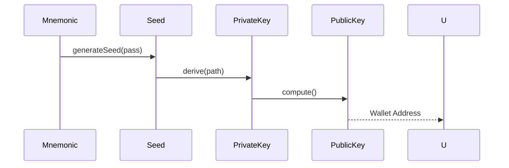
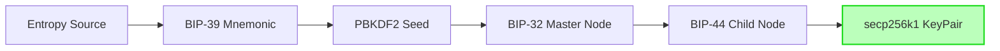

# web3_universal_crypto


[](https://pub.dev/packages/web3_universal_crypto)
[](https://opensource.org/licenses/MIT)

Cryptographic primitives for the **Web3 Universal SDK**. This package provides security-first implementations of Ed25519, Schnorr (BIP-340), and Secp256k1 for cross-chain signing.

## Features

- 🔐 **Multi-Signature Support**: Native Schnorr (BIP-340) for Bitcoin Taproot.
- 🐚 **Ed25519**: High-performance implementation for Solana and Cosmos.
- 🔑 **HD Wallet**: Full BIP-32 and BIP-44 hierarchical deterministic derivation.
- 🧪 **High Test Coverage**: Verified against official test vectors from RFC 8032 and Bitcoin Core.

## Installation

Add this to your `pubspec.yaml`:

```yaml
dependencies:
  web3_universal_crypto: ^0.1.0
```

## Quick Start

```dart
import 'package:web3_universal_crypto/web3_universal_crypto.dart';

void main() {
  // Generate a Schnorr signature
  final keyPair = SchnorrKeyPair.generate();
  final message = Uint8List.fromList([0x01, 0x02]);
  final signature = keyPair.sign(message);
  print('Signature: ${signature.toHex()}');
}
```

## Platform Support

| Android | iOS | Web | macOS | Windows | Linux |
|:---:|:---:|:---:|:---:|:---:|:---:|
| ✅ | ✅ | ✅ | ✅ | ✅ | ✅ |

## Usage Flow


## 🏗️ Architecture



## 📚 Technical Reference

### Core Classes
| Class | Responsibility |
|-------|----------------|
| `Bip39` | Generates and validates mnemonic phrases and seeds. |
| `HDWallet` | Manages node trees and path-based key derivation. |
| `EthKeyPair` | Represents a raw private/public key pair and performs ECDSA. |
| `Keccak` | Provides Ethereum-standard Keccak-256 hashing. |

## 🛡️ Security Considerations

- **Memory Erasure**: Use `privateKey.fill(0)` (if available in buffer context) after deriving keys to minimize resident memory risk.
- **Entropy Source**: `Bip39.generate()` uses `Random.secure()`. On some platforms, ensure the underlying system RNG is properly initialized.
- **Do Not Log Keys**: Never log or print private keys or mnemonics in production. Use obfuscated logging if necessary.

## 💻 Usage

### Secure Multi-Account Derivation
```dart
import 'package:dart_web3_crypto/dart_web3_crypto.dart';

void main() {
  final mnemonic = "asset adjust total... (12 words)";
  final hdRoot = HDWallet.fromMnemonic(Mnemonic.fromSentence(mnemonic, WordList.english));

  // Derive Account #0 and Account #1
  final acc0 = hdRoot.derivePath("m/44'/60'/0'/0/0");
  final acc1 = hdRoot.derivePath("m/44'/60'/0'/0/1");

  print('Acc 0 Address: ${acc0.address}');
}
```

### Performance Hashing
```dart
final hash = Keccak.hash(Uint8List.fromList([0x01, 0x02]));
```

## 📦 Installation

```yaml
dependencies:
  dart_web3_crypto: ^0.1.0
```
