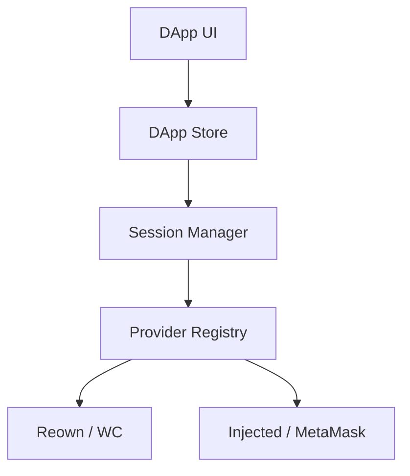

# dart_web3_dapp

High-level application framework for building decentralized applications (dApps) in Dart.

## Features

- **Store & State**: built-in state management for Web3 application data (accounts, networks).
- **Session Management**: Handle pairing and session persistence across multiple platforms.
- **Provider Discovery**: Easy integration with EIP-6963 and browser-based injection.
- **Unified Bridge**: Abstracted layer to switch between different wallet providers (Reown, Injected, Private Key).

## Architecture



## Usage

```dart
import 'package:dart_web3_dapp/dart_web3_dapp.dart';

void main() {
  final dapp = DAppStore();
  dapp.connect();
}
```

## Installation

```yaml
dependencies:
  dart_web3_dapp: ^0.1.0
```
