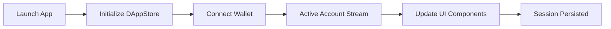
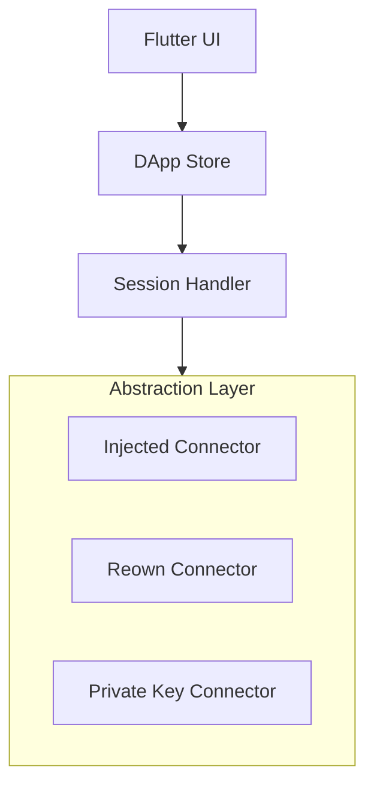

# dart_web3_dapp

<!-- Package not yet published to pub.dev -->
[](https://opensource.org/licenses/MIT)

A **comprehensive application framework** for building decentralized applications in Dart and Flutter. It provides the glue that connects your UI to state management, session persistence, and multi-provider connectivity.

## 🚀 Features

- **Unified Provider Store**: Switch between Injected, Reown, and Ledger providers without rewriting UI logic.
- **Reactive State**: Stream-based updates for account changes, network swaps, and connection status.
- **Auto-Discovery (EIP-6963)**: Intelligent detection of installed browser wallets on Web platforms.
- **Secure Persistence**: (Optional) hooks to save session data in encrypted local storage.

## Usage Flow


## 🏗️ Architecture



## 📚 Technical Reference

### Core Classes
| Class | Responsibility |
|-------|----------------|
| `DAppStore` | The central state hub for the entire application. |
| `Web3Connector` | Base class for adding new wallet connection methods. |
| `AccountState` | Immutable snapshot of connected address and chain. |
| `Eip6963Discovery` | Logic for detecting multiple browser extensions. |

## 🛡️ Security Considerations

- **Session Hijacking**: In Web environments, ensure the `origin` is strictly validated when receiving messages from browser extensions.
- **Data Leaks**: Avoid storing unencrypted private keys in the `DAppStore`. Prefer keeping keys in the `signer` layer and only holding the address in the `UI Store`.
- **Race Conditions**: When switching networks, ensure all pending requests are either cancelled or correctly re-routed to avoid inconsistent UI states.

## 💻 Usage

### Initializing a Reactive Store
```dart
import 'package:dart_web3_dapp/dart_web3_dapp.dart';

void main() {
  final store = DAppStore(
    connectors: [
      MetaMaskConnector(),
      ReownConnector(projectId: '...'),
    ],
  );

  // Listen for account changes
  store.activeAccount.listen((acc) {
    print('Current User: ${acc?.address}');
  });

  store.connect('metamask');
}
```

## 📦 Installation

```yaml
dependencies:
  dart_web3_dapp: ^0.1.0
```
