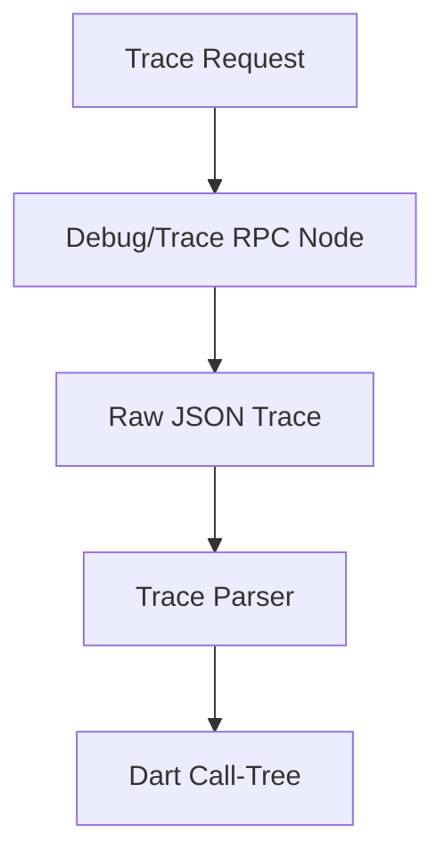

# dart_web3_debug

Advanced debugging, transaction tracing, and state simulation tools.

## Features

- **Tracing**: Access Geth and Erigon style execution traces.
- **Simulation**: Test transactions against arbitrary state overrides without on-chain execution.
- **Call Analysis**: Build hierarchical dependency trees of internal smart contract calls.
- **Gas Profiling**: Granular breakdown of gas usage per opcode/internal call.

## Architecture



## Usage

```dart
import 'package:dart_web3_debug/dart_web3_debug.dart';

void main() async {
  final debugger = TransactionDebugger(rpcUrl: '...');
  
  final trace = await debugger.traceTransaction('0xTxHash...');
  print('Number of internal calls: ${trace.calls.length}');
}
```

## Installation

```yaml
dependencies:
  dart_web3_debug: ^0.1.0
```
