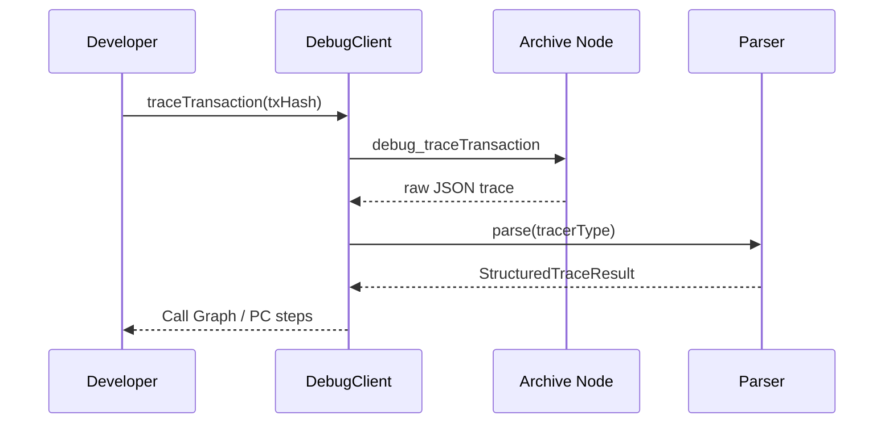
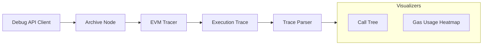

# dart_web3_debug

[](https://pub.dev/packages/dart_web3_debug)
[](https://opensource.org/licenses/MIT)

A **advanced diagnostic toolkit** for Ethereum developers. Gain deep visibility into contract execution, transaction traces, and node-level behavior using standard Debug and Trace API namespaces.

## 🚀 Features

- **Transaction Tracing**: Fetch detailed `debug_traceTransaction` results from Geth or Erigon nodes.
- **State Overrides**: Simulate transactions with arbitrary state changes (planned).
- **Call Tracers**: Support for JavaScript tracers and structural tracers for internal call analysis.
- **Log Foraging**: Advanced tools for reconstructing state from sparse event data.

## Usage Flow


## 🏗️ Architecture



## 📚 Technical Reference

### Core Classes
| Class | Responsibility |
|-------|----------------|
| `DebugClient` | Specialized provider for the `debug_*` namespace. |
| `TraceResult` | Nested structure reflecting the internal EVM call stack. |
| `EvmStep` | Individual instruction execution data (PC, Opcode, Gas). |
| `CallTracer` | Logic for parsing high-level internal contract calls. |

## 🛡️ Security Considerations

- **Archive Node Dependency**: Most `debug` methods require an Archive Node. Using them against standard nodes will result in RPC errors.
- **Data Volume**: Execution traces can be dozens of megabytes. Implement streaming parsers to avoid Out-Of-Memory (OOM) errors in Flutter apps.
- **Endpoint Protection**: The `debug` namespace is often restricted. Use authentication tokens or IP-whitelisting for your RPC provider.

## 💻 Usage

### Tracing Internal Calls
```dart
import 'package:dart_web3_debug/dart_web3_debug.dart';

void main() async {
  final debug = DebugClient(url: 'https://archive-node.io/...');

  final trace = await debug.traceTransaction(
    '0x...',
    tracer: TracerType.callTracer,
  );

  print('Internal calls: ${trace.calls?.length}');
}
```

## 📦 Installation

```yaml
dependencies:
  dart_web3_debug: ^0.1.0
```
