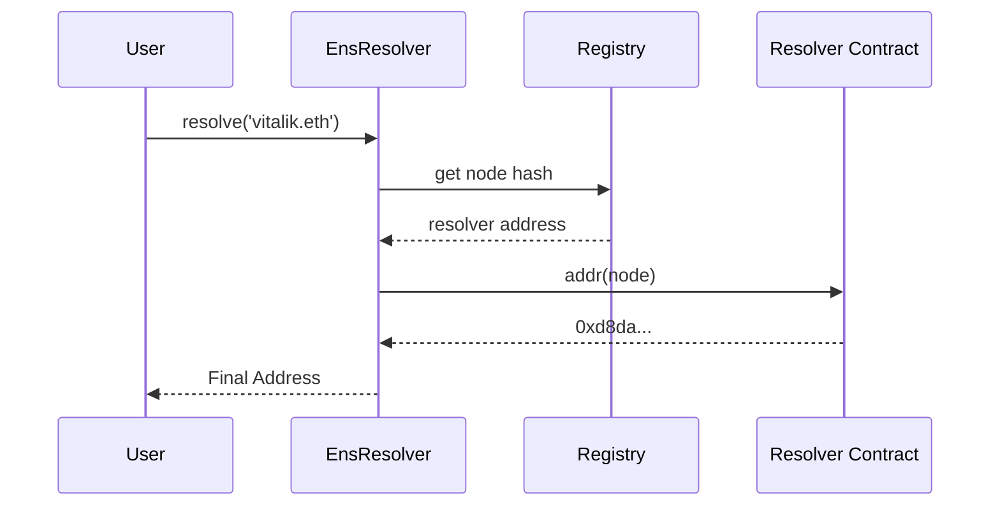
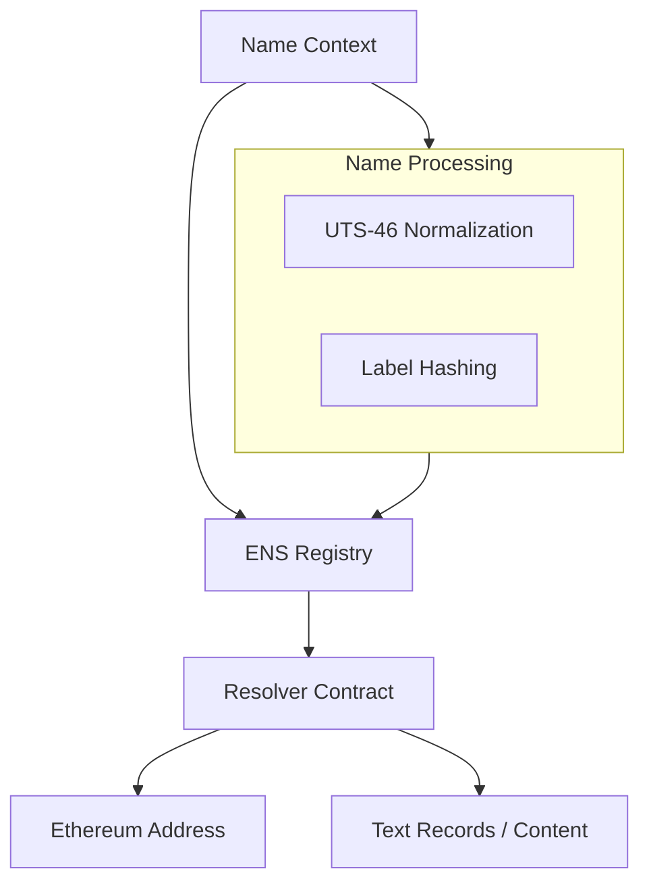

# dart_web3_ens

[](https://pub.dev/packages/web3_universal_ens)
[](https://opensource.org/licenses/MIT)

A **human-readable identity resolver** for the Dart Web3 ecosystem. It provides fully compliant support for the Ethereum Name Service (ENS), including forward resolution, reverse resolution, and off-chain data fetching.

## 🚀 Features

- **Forward Resolution**: Map names like `alice.eth` to `0x...` addresses.
- **Reverse Resolution**: Discover the ENS name associated with a specific address.
- **Content Discovery**: Fetch IPFS/IPNS hashes, avatar URLs, and social metadata associated with a name.
- **Wildcard & L2 Support**: (Planned) Support for EIP-3668 (CCIP-Read) for reduced gas resolution.

## Usage Flow


## 🏗️ Architecture



## 📚 Technical Reference

### Core Classes
| Class | Responsibility |
|-------|----------------|
| `Ens` | The main entry point for all resolution requests. |
| `EnsName` | An object representing a unique ENS node. |
| `EnsResolver` | Low-level logic for interacting with Resolver contracts. |
| `NameHash` | Implementation of the ENS namehash algorithm. |

## 🛡️ Security Considerations

- **UTS-46 Normalization**: Never manually hash a name string. Always use the built-in normalization logic to prevent homograph attacks and encoding errors.
- **Resolver Verification**: Before acting on resolution data, ensure the resolver returned is the one currently authorized by the official ENS Registry.
- **Trustless Avatars**: When displaying ENS avatars, use a secure proxy or verify the source URL to prevent UI-level exploits.

## 💻 Usage

### Complete Name Resolution
```dart
import 'package:dart_web3_ens/dart_web3_ens.dart';

void main() async {
  final ens = Ens(client: publicClient);

  // 1. Resolve Address
  final address = await ens.getAddress('vitalik.eth');
  print('Vitalik is at: $address');

  // 2. Fetch Text Records (Avatar, Email, etc.)
  final avatar = await ens.getText('vitalik.eth', key: 'avatar');
  print('Avatar URL: $avatar');
}
```

## 📦 Installation

```yaml
dependencies:
  dart_web3_ens: ^0.1.0
```
