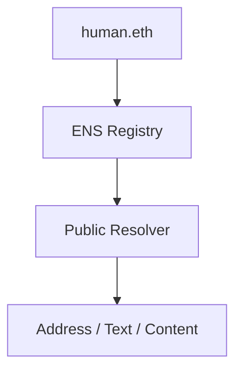

# dart_web3_ens

Complete Ethereum Name Service (ENS) integration for Dart.

## Features

- **Direct Resolution**: Convert `.eth` names to Ethereum addresses.
- **Reverse Resolution**: Find the primary ENS name for any given address.
- **Text Records**: Query metadata like email, twitter handles, and avatars.
- **Multi-Chain Support**: Resolves names across different Ethereum-compatible networks.

## Architecture



## Usage

```dart
import 'package:dart_web3_ens/dart_web3_ens.dart';

void main() async {
  final ens = ENS(client: myPublicClient);
  
  final address = await ens.resolve('vitalik.eth');
  print('Address: $address');
}
```

## Installation

```yaml
dependencies:
  dart_web3_ens: ^0.1.0
```
