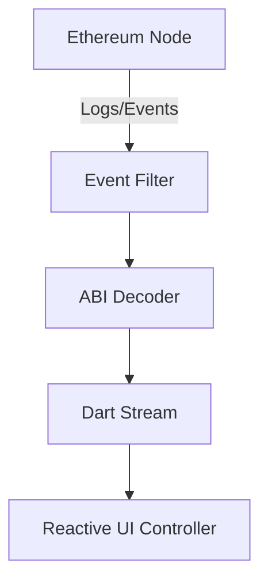

# dart_web3_events

Reactive event and log processing for Ethereum nodes.

## Features

- **Real-time Streams**: Connect to WebSocket providers for live event updates.
- **Log Reconciliation**: Process historical logs and new logs through a unified interface.
- **Advanced Filtering**: Use topics and block ranges to find specific contract interactions.
- **ABI Decoding**: Seamlessly convert raw log bytes into structured Dart objects using `dart_web3_abi`.

## Architecture



## Usage

### Listening for Transfers
```dart
import 'package:dart_web3_events/dart_web3_events.dart';

void main() {
  final listener = EventListener(
    contract: myContract,
    eventName: 'Transfer',
  );
  
  listener.stream.listen((event) {
    print('Transfer from ${event['from']} to ${event['to']}');
  });
}
```

## Installation

```yaml
dependencies:
  dart_web3_events: ^0.1.0
```
