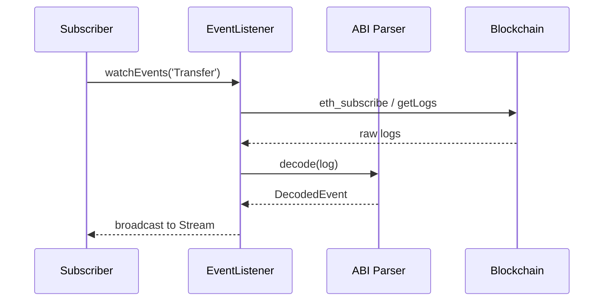

# dart_web3_events

<!-- Package not yet published to pub.dev -->
[](https://opensource.org/licenses/MIT)

A **reactive event processing engine** for Ethereum logs. It simplifies the complexity of filtering, parsing, and streaming smart contract events into your application UI.

## 🚀 Features

- **Unified Log Interface**: Same API for historical log queries and live WebSocket streams.
- **Type-Safe Decoding**: Automatically decodes log topics and data into structured Dart maps.
- **Reorg Resilience**: Hooks for handling chain re-organizations (planned).
- **Efficient Filtering**: Multi-topic filtering for complex contract interactions.

## Usage Flow


## 🏗️ Architecture


## 📚 Technical Reference

### Core Classes
| Class | Responsibility |
|-------|----------------|
| `LogFilter` | Pure data structure defining what events to look for. |
| `EventListener` | Active worker that manages the polling or subscription lifecycle. |
| `DecodedEvent` | Container for parsed log data (name, params, block metadata). |
| `EventParser` | Low-level utility for ABI-based log decoding. |

## 🛡️ Security Considerations

- **Log Spoofing**: Never trust logs as the absolute source of truth for financial balances without double-checking the contract state, especially in the first few blocks.
- **Topic Hashing**: Ensure your topic filters are generated using the correct Keccak-256 hash of the full event signature (e.g., `Transfer(address,address,uint256)`).
- **WebSocket Stability**: In Flutter apps, implement heartbeat/reconnect logic for WebSocket-based event streams to handle mobile network switching.

## 💻 Usage

### Polling for Historical Transfers
```dart
import 'package:dart_web3_events/dart_web3_events.dart';

void main() async {
  final listener = EventListener(contract: erc20Token);

  // Query last 1000 blocks
  final logs = await listener.getPastEvents(
    eventName: 'Transfer',
    fromBlock: BlockNumber.recent(1000),
  );

  for (var log in logs) {
    print('From: ${log.params['from']}, Amount: ${log.params['value']}');
  }
}
```

## 📦 Installation

```yaml
dependencies:
  dart_web3_events: ^0.1.0
```
