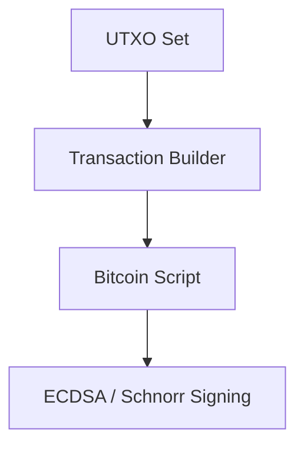

# dart_web3_bitcoin

Bitcoin extension for the Dart Web3 SDK, supporting legacy and modern standards.

## Features

- **Address Formats**: Support for P2PKH (Legacy), P2SH, P2WPKH (SegWit), and P2TR (Taproot).
- **Transaction Engine**: Built-in UTXO management and transaction building from scratch.
- **Scripting**: Support for Opus, Scripts, and basic Bitcoin-native multisig.
- **Networking**: Compatible with Electrum, Blockbook, and Bitcoin Core RPCs.

## Architecture



## Usage

```dart
import 'package:dart_web3_bitcoin/dart_web3_bitcoin.dart';

void main() {
  final addr = BitcoinAddress.fromMnemonic(mnemonic, network: BitcoinNetwork.mainnet);
  print('SegWit Address: ${addr.bech32}');
}
```

## Installation

```yaml
dependencies:
  dart_web3_bitcoin: ^0.1.0
```
