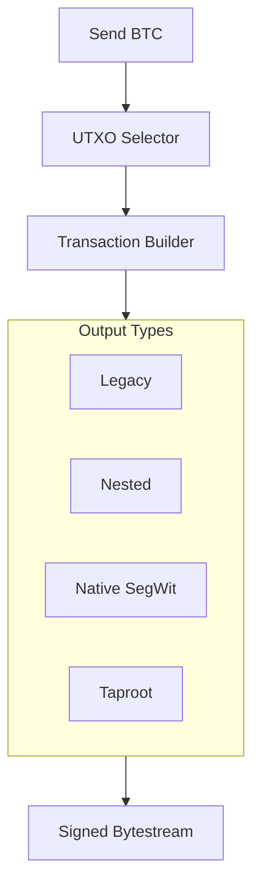

# dart_web3_bitcoin

[](https://pub.dev/packages/dart_web3_bitcoin)
[](https://opensource.org/licenses/MIT)

A **robust Bitcoin extension** for the Dart Web3 SDK. Brings Bitcoin's UTXO-based architecture and advanced scripting capabilities to the unified Dart API.

## 🚀 Features

- **UTXO Management**: Advanced logic for coin selection and change address calculation.
- **SegWit & Taproot**: Support for modern Bitcoin address formats (Bech32/Bech32m).
- **PSBT Support**: Partially Signed Bitcoin Transactions for multi-sig and air-gapped flows.
- **Lightning Ready**: (Planned) Primitives for Lightning Network payment channels.

## 🏗️ Architecture



## 📚 Technical Reference

### Core Classes
| Class | Responsibility |
|-------|----------------|
| `BtcClient` | High-level client for interacting with Bitcoin nodes or explorers. |
| `Utxo` | Represents an individual unspent transaction output. |
| `Psbt` | The standard format for sharing unsigned/partially signed data. |
| `BtcAddress` | Comprehensive support for all Bitcoin address prefixes. |

## 🛡️ Security Considerations

- **Fee Sniper Protection**: Use RBF (Replace-By-Fee) settings cautiously; the SDK enables RBF by default for flexibility.
- **Change Address Leakage**: Always use a new change address for every transaction to maintain user privacy (BIP-44 compliance).
- **Dust Limit**: Ensure your outputs are above the network dust limit (e.g., 546 satoshis) to prevent transaction rejection.

## 💻 Usage

### Building a SegWit Transaction
```dart
import 'package:dart_web3_bitcoin/dart_web3_bitcoin.dart';

void main() async {
  final btc = BtcClient();
  final wallet = BtcWallet.fromMnemonic('...', type: AddressType.p2wpkh);

  final tx = await btc.buildTransaction(
    to: 'bc1q...',
    amount: 100000, // 0.001 BTC
    feeRate: 25,    // sats/vbyte
    signer: wallet,
  );
  
  print('Bitcoin Tx Hash: $tx');
}
```

## 📦 Installation

```yaml
dependencies:
  dart_web3_bitcoin: ^0.1.0
```
