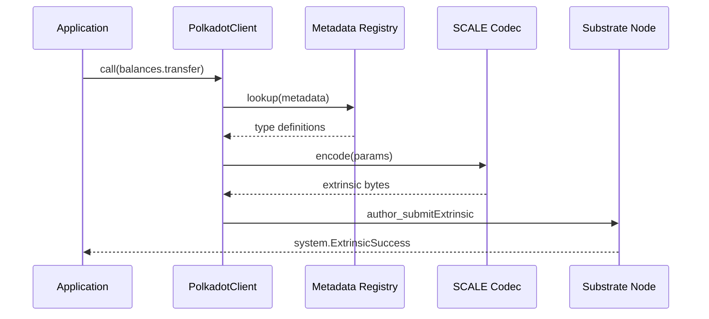
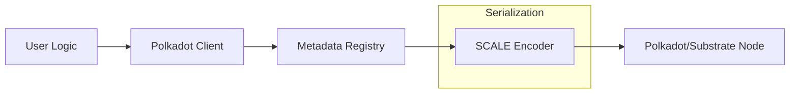

# dart_web3_polkadot

<!-- Package not yet published to pub.dev -->
[](https://opensource.org/licenses/MIT)

A **Substrate-compatible extension** for the Dart Web3 ecosystem. Enable interaction with Polkadot, Kusama, and the entire Parachain ecosystem using a unified Dart API.

## 🚀 Features

- **SS58 Addressing**: Multi-chain address formatting with support for different network prefixes.
- **SCALE Codec**: highly efficient Simple Concatenated Aggregate Little-Endian encoding.
- **Metadata V14+**: Dynamically parse Substrate metadata to discover pallet methods and constants.
- **SR25519 & Ed25519**: Full support for standard Substrate signature schemes.

## Usage Flow


## 🏗️ Architecture



## 📚 Technical Reference

### Core Classes
| Class | Responsibility |
|-------|----------------|
| `PolkadotClient` | The core client for Substrate-based JSON-RPC. |
| `Keyring` | Manages multiple accounts and encryption types (sr25519). |
| `ScaleCodec` | Low-level utility for binary serialization. |
| `Registry` | Holds types and method definitions for a specific parachain. |

## 🛡️ Security Considerations

- **Metadata Integrity**: Substrate updates can change underlying types. Always fetch the latest metadata from the node before encoding transactions.
- **Existential Deposit**: Be aware of the Existential Deposit (ED) requirement; sending an amount that leaves a balance below ED will result in account reaper/deletion.
- **Multi-sig Complexity**: Substrate multisig uses a "call hash" approach. Ensure the UI handles the 2-step approval process correctly.

## 💻 Usage

### Connecting and Querying Balance
```dart
import 'package:dart_web3_polkadot/dart_web3_polkadot.dart';

void main() async {
  final dot = PolkadotClient(url: 'wss://rpc.polkadot.io');
  await dot.init();

  final balance = await dot.queryBalance('AddressSS58...');
  print('DOT Balance: $balance');
}
```

## 📦 Installation

```yaml
dependencies:
  dart_web3_polkadot: ^0.1.0
```
