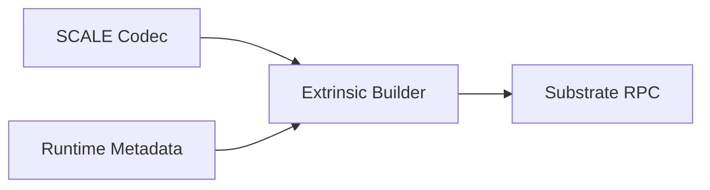

# dart_web3_polkadot

Substrate and Polkadot ecosystem extension for the Dart Web3 SDK.

## Features

- **SCALE Codec**: Highly optimized implementation of the Substrate SCALE codec.
- **Metadata**: Recursive parsing of Substrate runtime metadata for type-safe interactions.
- **Multi-Chain**: Seamless support for Polkadot, Kusama, and custom parachains.
- **Extrinsics**: Build and sign Substrate transactions with full support for mortality.

## Architecture



## Usage

```dart
import 'package:dart_web3_polkadot/dart_web3_polkadot.dart';

void main() async {
  final polkadot = PolkadotClient(url: 'wss://rpc.polkadot.io');
  // Interact using Scale-encoded extrinsics
}
```

## Installation

```yaml
dependencies:
  dart_web3_polkadot: ^0.1.0
```
