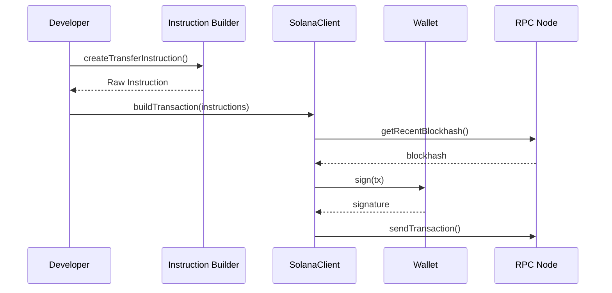
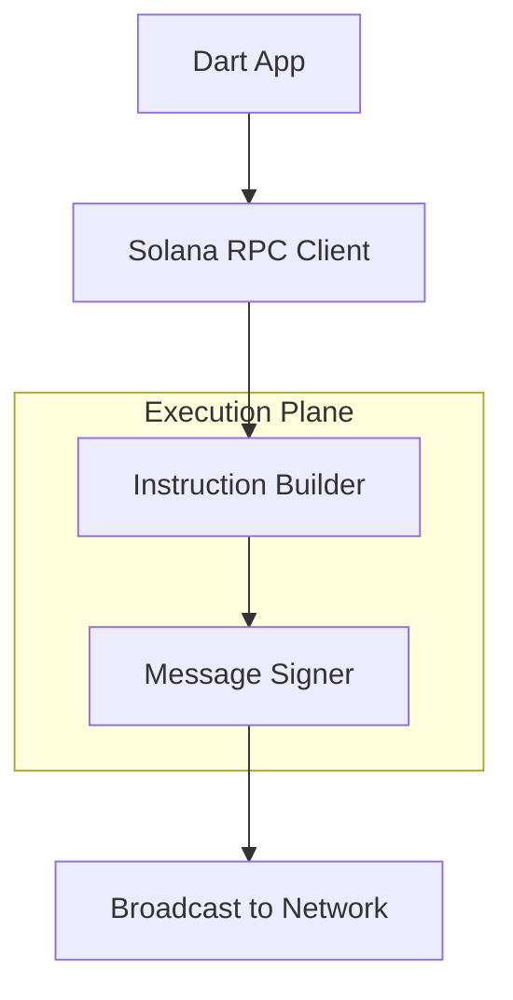

# dart_web3_solana

[](https://pub.dev/packages/dart_web3_solana)
[](https://opensource.org/licenses/MIT)

A **high-performance Solana extension** for the Dart Web3 ecosystem. Brings the power of the SVM (Solana Virtual Machine) to Dart and Flutter applications.

## 🚀 Features

- **SVM Primitives**: Native support for Ed25519 keypairs and Base58 addresses.
- **Borsh Codec**: Optimized Binary Object Representation Serializer for program interactions.
- **SPL Token Suite**: Direct support for Minting, Transferring, and Managing SPL tokens.
- **PDA Derivation**: Advanced logic for deriving Program Derived Addresses with seeds.

## Usage Flow


## 🏗️ Architecture



## 📚 Technical Reference

### Core Classes
| Class | Responsibility |
|-------|----------------|
| `SolanaClient` | The main JSON-RPC provider for Solana nodes. |
| `SolanaWallet` | Manages Ed25519 identities and transaction signing. |
| `Borsh` | Coding utility for Solana's program data format. |
| `TransactionInstruction` | Low-level element for building complex SVM calls. |

## 🛡️ Security Considerations

- **PDA Checking**: Always verify PDA derivation seeds on the client side before sending transactions to prevent "fake account" exploits.
- **Compute Budget**: Solana transactions have strict compute limits. The SDK provides tools to request additional compute budget via instructions.
- **Recent Blockhash**: Solana transactions expire quickly. Ensure your UI logic fetches a fresh blockhash immediately before signing.

## 💻 Usage

### Sending SPL Tokens
```dart
import 'package:dart_web3_solana/dart_web3_solana.dart';

void main() async {
  final solana = SolanaClient(url: 'https://api.mainnet-beta.solana.com');
  final wallet = SolanaWallet.fromMnemonic('...');

  final tx = await solana.transferSpl(
    to: 'DestAddress...',
    mint: 'TokenMintAddress...',
    amount: 1000000, // 1.0 SOL (if 9 decimals)
    signer: wallet,
  );
  
  print('Solana Confirmation: $tx');
}
```

## 📦 Installation

```yaml
dependencies:
  dart_web3_solana: ^0.1.0
```
