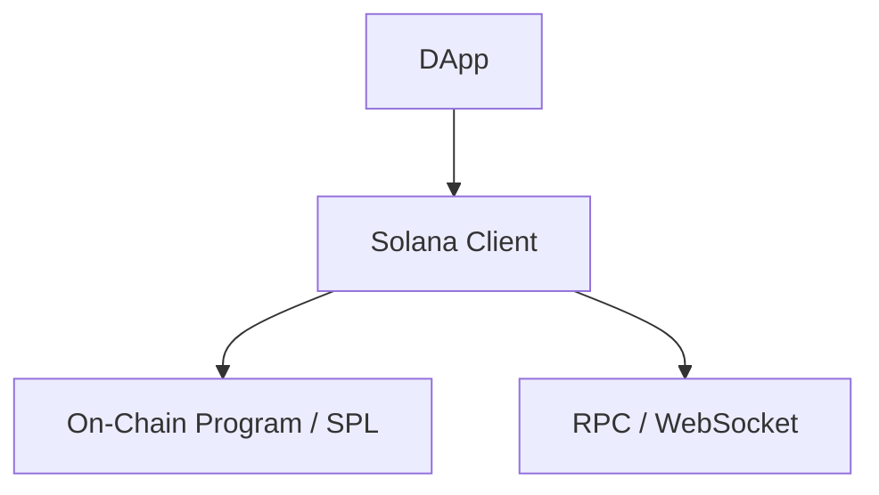

# dart_web3_solana

Solana blockchain extension for the Dart Web3 ecosystem.

## Features

- **Accounts**: Support for Ed25519 keypairs and PDA (Program Derived Address) derivation.
- **Serialization**: Optimized Borsh serialization for Solana programs.
- **RPC Client**: Comprehensive support for Solana's JSON-RPC, including long-polling.
- **SPL Tokens**: Full support for the Solana Program Library (Token-2022, etc.).

## Architecture



## Usage

```dart
import 'package:dart_web3_solana/dart_web3_solana.dart';

void main() async {
  final solana = SolanaClient(url: 'https://api.mainnet-beta.solana.com');
  final balance = await solana.getBalance('SolanaAddress...');
}
```

## Installation

```yaml
dependencies:
  dart_web3_solana: ^0.1.0
```
