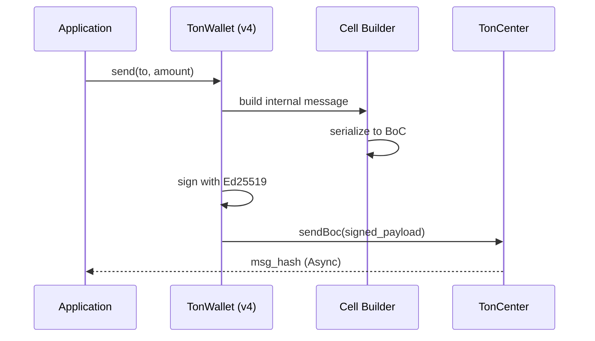

# dart_web3_ton

[](https://pub.dev/packages/web3_universal_ton)
[](https://opensource.org/licenses/MIT)

A **The Open Network (TON) extension** for the Dart Web3 ecosystem. Connect your applications to TON's unique asynchronous architecture and Jetton ecosystem.

## 🚀 Features

- **Cell & BoC Logic**: Pure Dart implementation of TON's "Bag of Cells" serialization.
- **Wallet v3/v4**: Support for the most common TON wallet contract versions.
- **Jetton Interaction**: Standardized API for interacting with TON fungible tokens (Jettons).
- **Lite Client Bridge**: (Planned) High-performance connectivity to the TON blockchain.

## Usage Flow


## 🏗️ Architecture

```mermaid
graph LR
    Logic [Dart App] --> BoC[Cell Serializer]
    BoC --> TonCenter[TonCenter API]
    
    subgraph Cell_Tree [Recursive Structure]
        Root[Root Cell] --> Ref1[Ref 1]
        Root --> Ref2[Ref 2]
    end
    
    BoC --> Cell_Tree
```

## 📚 Technical Reference

### Core Classes
| Class | Responsibility |
|-------|----------------|
| `TonClient` | Interface for communicating with TON providers (TonCenter). |
| `TonWallet` | Manages TON account versions and sequence numbers. |
| `Cell` | The fundamental data unit of the TON blockchain. |
| `JettonWallet` | Specialized logic for managing TON assets. |

## 🛡️ Security Considerations

- **Bounceable Addresses**: TON has "Bounceable" and "Non-bounceable" address formats. Using the wrong one for an uninitialized account might result in lost funds.
- **Async Execution**: Transactions in TON are asynchronous. The SDK provides hooks to poll for message delivery status.
- **Sequence Management**: TON wallets rely on sequential nonces; ensure your app handles local state correctly to avoid out-of-order errors.

## 💻 Usage

### Sending TON to a Bounceable Address
```dart
import 'package:dart_web3_ton/dart_web3_ton.dart';

void main() async {
  final ton = TonClient(apiKey: '...');
  final wallet = TonWallet.v4(mnemonic: '...');

  final hash = await wallet.send(
    to: 'EQD...', // Bounceable address
    amount: TonUnit.ton('0.5'),
    stateInit: false,
  );
  
  print('TON msg hash: $hash');
}
```

## 📦 Installation

```yaml
dependencies:
  dart_web3_ton: ^0.1.0
```
