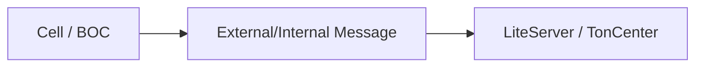

# dart_web3_ton

TON (The Open Network) blockchain extension for the Dart Web3 SDK.

## Features

- **Wallet Versions**: Full support for Wallet v3, v4, and Highload contract versions.
- **BOC Handling**: Robust "Bag of Cells" serialization/deserialization for TON messages.
- **TL-B Support**: Parse and build complex TON-specific data structures.
- **JETTONS & NFTs**: Specialized handlers for TON token and NFT standards.

## Architecture



## Usage

```dart
import 'package:dart_web3_ton/dart_web3_ton.dart';

void main() async {
  final ton = TonClient(url: 'https://toncenter.com/api/v2/jsonRPC');
  final wallet = TonWallet.v4(publicKey: ...);
}
```

## Installation

```yaml
dependencies:
  dart_web3_ton: ^0.1.0
```
