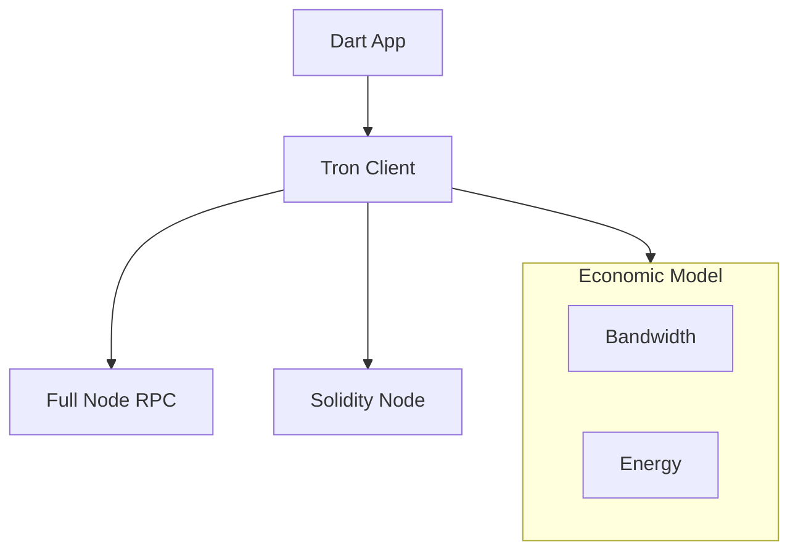

# dart_web3_tron

[](https://pub.dev/packages/dart_web3_tron)
[](https://opensource.org/licenses/MIT)

A **full-featured TRON extension** for the Dart Web3 ecosystem. Effortlessly interact with the TVM (Tron Virtual Machine), manage Bandwidth/Energy, and perform high-speed asset transfers.

## 🚀 Features

- **TVM Primitives**: Base58Check addressing and Protobuf-based transaction modeling.
- **Resource Management**: Logic for Freezing/Unfreezing TRX to gain Bandwidth and Energy.
- **TRC-20 Support**: Specialized wrappers for USDT and other popular tokens on TRON.
- **Multi-Sig & Permissions**: Advanced support for TRON's multi-signature and account permission systems.

## 🏗️ Architecture



## 📚 Technical Reference

### Core Classes
| Class | Responsibility |
|-------|----------------|
| `TronClient` | Primary interface for TRON HTTP and gRPC services (planned). |
| `TronWallet` | Identity manager for TRON private keys and addresses. |
| `Trc20Contract` | Specialized logic for TRC-20 token standards. |
| `TronTransaction` | Unified model for TRX, Token, and Contract actions. |

## 🛡️ Security Considerations

- **Burn vs Stake**: If an account has zero Energy, TRX will be burned for transaction fees. Always verify resource availability in the UI before execution.
- **Base58 Integrity**: TRON addresses use a leading `T`. Ensure proper validation to prevent sending TRX to Ethereum addresses by mistake.
- **Contract Expiration**: TRON transaction expiration is relative. The SDK automatically sets optimal values based on the latest block height.

## 💻 Usage

### Transferring USDT (TRC-20)
```dart
import 'package:dart_web3_tron/dart_web3_tron.dart';

void main() async {
  final tron = TronClient(apiKey: '...');
  final usdt = Trc20Contract(address: 'TR7NHq...', client: tron);

  final hash = await usdt.transfer(
    to: 'ReceiverTAddress...',
    amount: BigInt.from(10000000), // 10.0 USDT
    signer: myTronSigner,
  );
  
  print('Tron Tx Hash: $hash');
}
```

## 📦 Installation

```yaml
dependencies:
  dart_web3_tron: ^0.1.0
```
