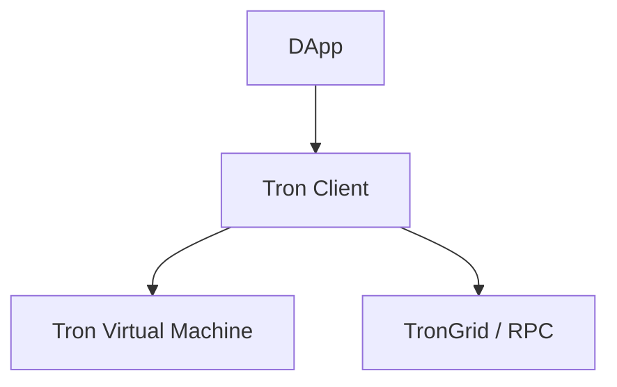

# dart_web3_tron

Tron (TRX) blockchain and TVM extension for the Dart Web3 SDK.

## Features

- **Account Management**: Support for base58check addresses and Tron-specific cryptography.
- **Protocol Support**: Deep integration for TRX, TRC-10, and TRC-20 tokens.
- **TVM**: Interact with Tron Virtual Machine smart contracts using ABI logic.
- **Resource Management**: Manage account Energy and Bandwidth via staking.

## Architecture



## Usage

```dart
import 'package:dart_web3_tron/dart_web3_tron.dart';

void main() async {
  final tron = TronClient(url: 'https://api.trongrid.io');
  final balance = await tron.getTRXBalance('TronAddress...');
}
```

## Installation

```yaml
dependencies:
  dart_web3_tron: ^0.1.0
```
