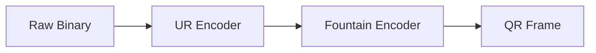

# dart_web3_bc_ur

Dart implementation of the BC-UR (Blockchain Uniform Resource) standard for air-gapped data transmission.

## Features

- **UR Encoding**: Efficient encoding of binary data into QR-friendly UR strings.
- **Fountain Codes**: Support for multi-part QR codes using Luby Transform (LT) codes.
- **Type Safety**: Built-in registry for common blockchain data types (PSBT, ETH-TX).
- **Interoperability**: Fully compatible with Keystone, Foundation, and BlueWallet implementations.

## Architecture



## Usage

```dart
import 'package:dart_web3_bc_ur/dart_web3_bc_ur.dart';

void main() {
  final ur = UR.encode(binaryData, type: 'eth-signature');
  print('UR: ${ur.toString()}');
}
```

## Installation

```yaml
dependencies:
  dart_web3_bc_ur: ^0.1.0
```
