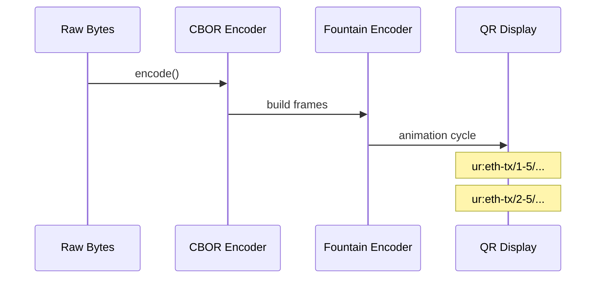
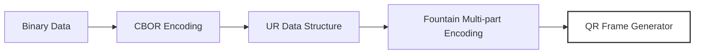

# dart_web3_bc_ur

[](https://pub.dev/packages/dart_web3_bc_ur)
[](https://opensource.org/licenses/MIT)

A **pure Dart implementation of the Blockchain Uniform Resource (BC-UR)** standard. It enables efficient, segmented, and secure data transmission via QR codes, specifically designed for air-gapped hardware wallets.

## 🚀 Features

- **Fountain Codes (UR)**: Robust data segmentation using Luby Transform (LT) codes for large transaction payloads.
- **Type Registry**: Support for standardized UR types including `crypto-multi-accounts`, `eth-signature`, and `psbt`.
- **Cbor Logic**: Built-in CBOR encoding/decoding compliant with the UR specification.
- **Hardware Agnostic**: Fully compatible with Keystone, Foundation, SeedSigner, and BlueWallet implementations.

## Usage Flow


## 🏗️ Architecture



## 📚 Technical Reference

### Core Classes
| Class | Responsibility |
|-------|----------------|
| `UR` | The primary object representing a Blockchain Uniform Resource. |
| `UREncoder` | Logic for dividing large data into multiple QR-friendly parts. |
| `URDecoder` | Collects and reconstructs original data from scanned QR frames. |
| `URTypes` | Standard registry for air-gapped data types. |

## 🛡️ Security Considerations

- **Visual Data Transfer**: Air-gapped communication via QR codes provides a physical barrier against remote exploits.
- **Segment Integrity**: The UR protocol includes checksums for every frame; the decoder ensures 100% data integrity before reconstruction.
- **Data Leakage**: Although QR-based, ensure sensitive data is not scanned in environments where unauthorized cameras might be recording.

## 💻 Usage

### Generating Multiple QR Frames
```dart
import 'package:dart_web3_bc_ur/dart_web3_bc_ur.dart';

void main() {
  final payload = Uint8List.fromList([0xDE, 0xAD, 0xBE, 0xEF]);
  final ur = UR.encode(payload, type: URTypes.ethTx);

  final encoder = UREncoder(ur, maxPartSize: 200);
  
  // Get the next QR part to display
  while (!encoder.isComplete) {
     final frame = encoder.nextPart();
     print('Display QR: $frame');
  }
}
```

## 📦 Installation

```yaml
dependencies:
  dart_web3_bc_ur: ^0.1.0
```
