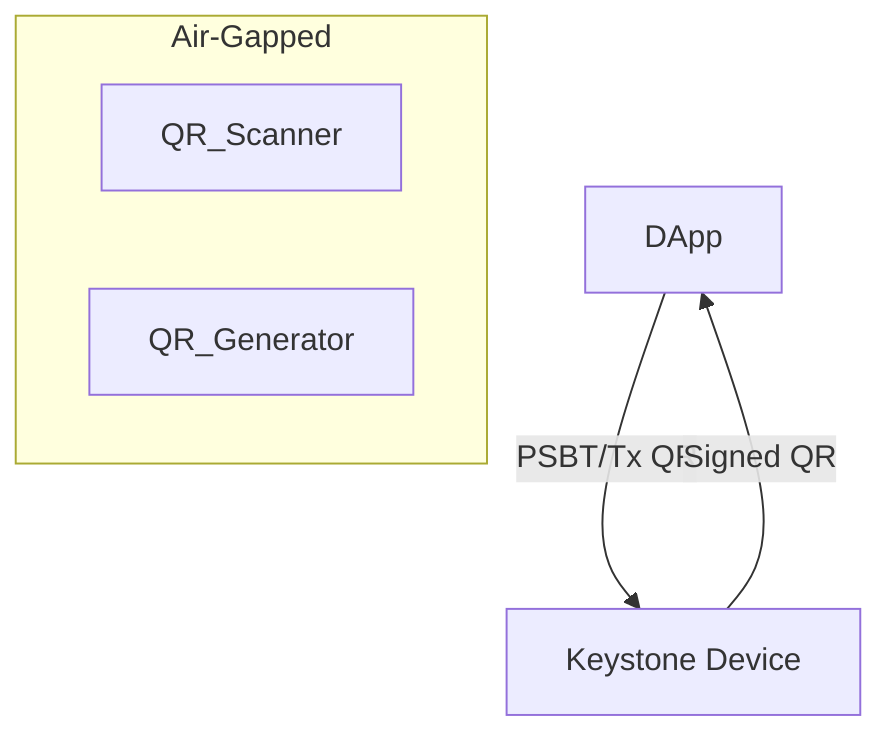

# dart_web3_keystone

Keystone hardware wallet support via secure air-gapped QR communication.

## Features

- **QR Protocol**: Implementation of the Keystone Uniform Resource (UR) and BC-UR standards.
- **Air-Gapped Signing**: Sign transactions and messages without any wired or wireless connection.
- **Account Discovery**: Scan QR codes from Keystone to import multiple addresses and public keys.
- **PSBT Support**: Full integration for Bitcoin Partially Signed Bitcoin Transactions.

## Architecture



## Usage

```dart
import 'package:dart_web3_keystone/dart_web3_keystone.dart';

void main() {
  final decoder = KeystoneQRDecoder();
  // Call upon scanning a QR code from the Keystone device
  final result = decoder.decode(scannedText);
}
```

## Installation

```yaml
dependencies:
  dart_web3_keystone: ^0.1.0
```
