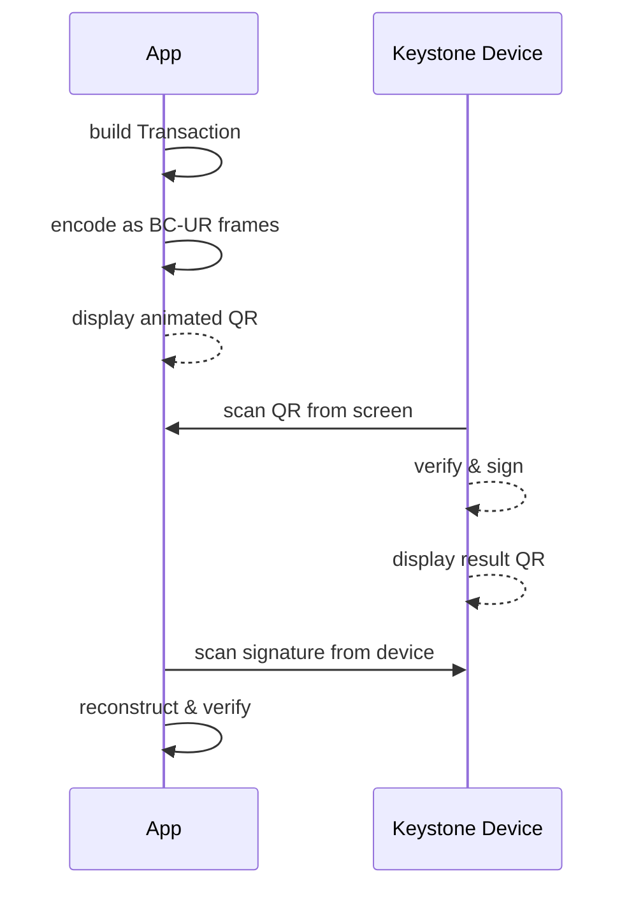
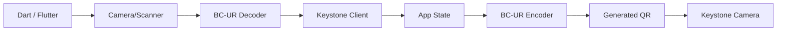

# dart_web3_keystone

<!-- Package not yet published to pub.dev -->
[](https://opensource.org/licenses/MIT)

A **high-security interface for Keystone hardware wallets**. Fully supports air-gapped communication via the BC-UR protocol for Ethereum and multi-chain signing workflows.

## 🚀 Features

- **Air-Gapped QR Connect**: Complete implementation of Keystone's multi-part QR protocol.
- **Signature Verification**: Parse and verify Keystone-signed Ethereum transactions and messages.
- **Multi-Account Sync**: Efficiently sync hundreds of derived accounts from a single Keystone QR scan.
- **Safe Multisig**: Specialized support for Keystone-based multisig wallet configurations.

## Usage Flow


## 🏗️ Architecture



## 📚 Technical Reference

### Core Classes
| Class | Responsibility |
|-------|----------------|
| `KeystoneClient` | The main interface for hardware synchronization. |
| `KeystoneAccount` | Represents an account public-key and derivation path from the device. |
| `KeystoneSignature` | Wrapper for parsing signatures returned via QR. |
| `KeystoneTransaction` | Logic for encoding data for Keystone device display. |

## 🛡️ Security Considerations

- **Verify on Screen**: Always instruct users to verify the transaction details (Recipient, Amount, Fee) on the Keystone's physical screen.
- **Air-Gapped Integrity**: This module relies on `dart_web3_bc_ur`. Ensure no un-audited dependencies are injected into the transport layer.
- **Key Extraction**: Hardware wallets like Keystone are designed to never leak the private key; this SDK only handles public keys and signed payloads.

## 💻 Usage

### Synchronizing Wallet Data
```dart
import 'package:dart_web3_keystone/dart_web3_keystone.dart';

void main() {
  final keystone = KeystoneClient();

  // 1. Scan the Sync QR from Keystone
  keystone.decodeSync(qrData);

  for (var account in keystone.accounts) {
    print('Derived Address: ${account.address}');
    print('Path: ${account.path}');
  }
}
```

## 📦 Installation

```yaml
dependencies:
  dart_web3_keystone: ^0.1.0
```
