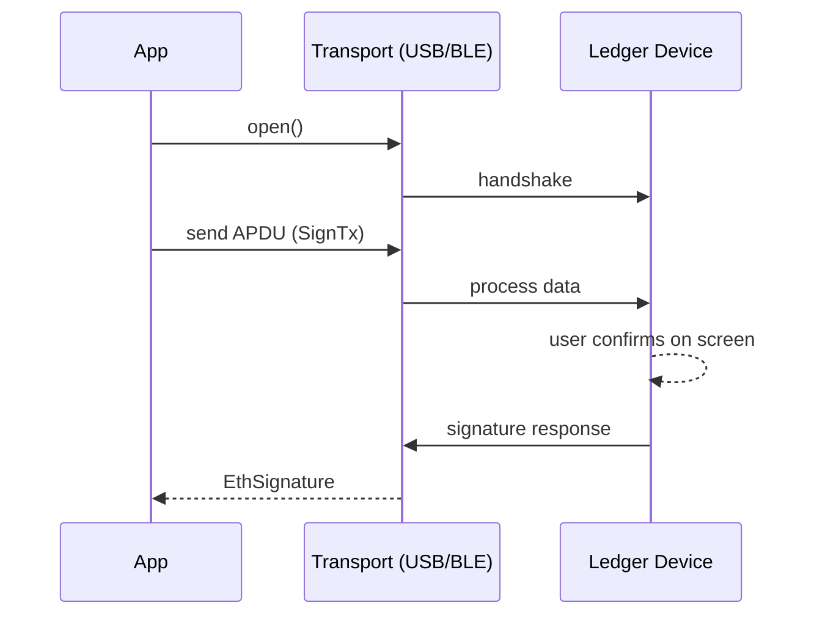
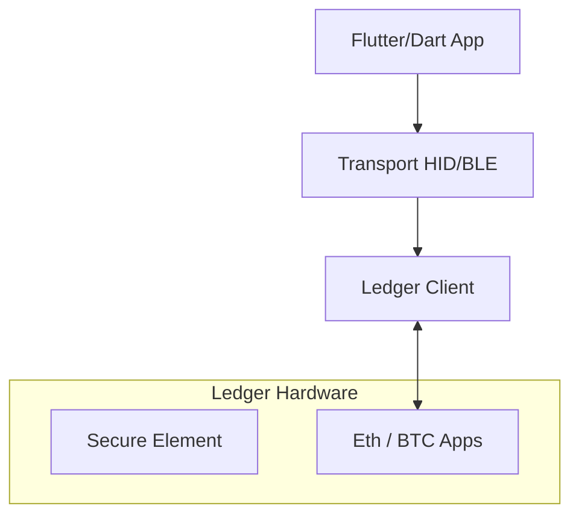

# dart_web3_ledger

<!-- Package not yet published to pub.dev -->
[](https://opensource.org/licenses/MIT)

Professional **Ledger hardware wallet support** for Dart. Connect via USB or Bluetooth to perform secure, on-device signing for Ethereum and other supported blockchains.

## 🚀 Features

- **Multi-Transport**: Native support for Ledger HID (USB) on Desktop/Mobile and Bluetooth (BLE) on iOS/Android.
- **Secure Signing**: Fully compatible with the Ledger Ethereum App (including Clear Signing for EIP-712).
- **Device Management**: List, connect, and monitor device status (Locked, App Not Open).
- **Path Derivation**: Access any BIP-44 account directly from the hardware's secure element.

## Usage Flow


## 🏗️ Architecture



## 📚 Technical Reference

### Core Classes
| Class | Responsibility |
|-------|----------------|
| `LedgerConnection` | Manages the raw byte-stream to the device. |
| `LedgerAppEth` | High-level API for Ethereum-specific commands. |
| `LedgerScanner` | Service for discovering Bluetooth-enabled devices. |
| `APDU` | Low-level protocol units for Ledger communication. |

## 🛡️ Security Considerations

- **Bluetooth Bonding**: When using BLE, ensure your application handles bonding correctly to prevent man-in-the-middle pairing attempts.
- **Firmware Versions**: The SDK target specific APDU versions. Warn users if their device firmware is outdated to avoid signing failures.
- **Physical Verification**: The "Golden Rule" of hardware wallets: Never trust the computer; only trust what is on the device screen.

## 💻 Usage

### Fetching Address (USB)
```dart
import 'package:dart_web3_ledger/dart_web3_ledger.dart';

void main() async {
  final ledger = LedgerConnection.usb();
  await ledger.open();

  final ethApp = LedgerAppEth(ledger);
  
  // Shows 'Verify Address' prompt on device
  final address = await ethApp.getAddress("m/44'/60'/0'/0/0", display: true);
  print('Connected: $address');
}
```

## 📦 Installation

```yaml
dependencies:
  dart_web3_ledger: ^0.1.0
```
