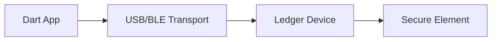

# dart_web3_ledger

Hardware-level security for Dart using the Ledger device ecosystem.

## Features

- **Multi-Transport**: Support for Ledger HID (USB) and Bluetooth Low Energy (BLE).
- **App Connectivity**: Interaction with Ethereum, Bitcoin, and other specific Ledger apps.
- **Address Validation**: Securely display and verify addresses on the physical device screen.
- **Transaction Signing**: Support for EIP-1559, Legacy, and complex smart contract interactions.

## Architecture



## Usage

```dart
import 'package:dart_web3_ledger/dart_web3_ledger.dart';

void main() async {
  final ledger = LedgerClient();
  final devices = await ledger.listDevices();
  
  if (devices.isNotEmpty) {
     final device = await ledger.connect(devices.first);
     final address = await device.getAddress(path: "m/44'/60'/0'/0/0");
  }
}
```

## Installation

```yaml
dependencies:
  dart_web3_ledger: ^0.1.0
```
