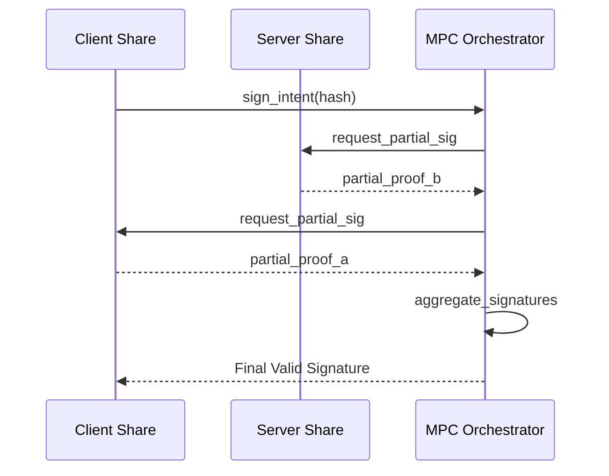
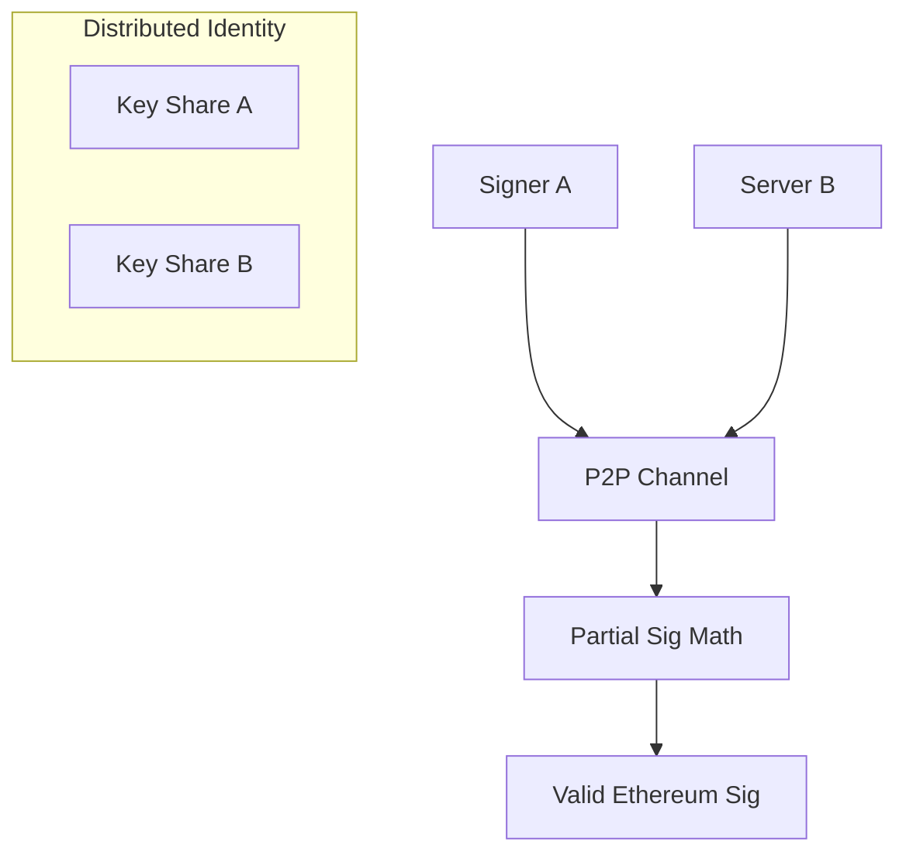

# dart_web3_mpc

[](https://pub.dev/packages/dart_web3_mpc)
[](https://opensource.org/licenses/MIT)

A **Multi-Party Computation (MPC) extension** for the Dart Web3 ecosystem. Enable "keyless" security by distributing key shares across multiple devices or stakeholders using threshold cryptography.

## 🚀 Features

- **TSS Support**: Support for Threshold Signature Schemes (GG20 / GG18) in Dart.
- **Shamir shares**: Standard Shamir Secret Sharing (SSS) for backup and recovery.
- **Distributed Signing**: Create valid ECDSA signatures without ever assembling a full private key on one device.
- **Enterprise Ready**: Designed for institutional wallet flows and 2-of-2 mobile-cloud pairings.

## Usage Flow


## 🏗️ Architecture



## 📚 Technical Reference

### Core Classes
| Class | Responsibility |
|-------|----------------|
| `MpcSigner` | Implements the distributed signing state machine. |
| `SecretShare` | Representation of an individual cryptographic fragment. |
| `DkgEngine` | Distributed Key Generation (DKG) orchestrator. |
| `ThresholdConfig` | Defines n-of-m requirements for a valid signature. |

## 🛡️ Security Considerations

- **Secure Channels**: MPC communication must happen over TLS or E2EE (End-to-End Encrypted) channels.
- **Share Persistence**: Never store MPC shares in plain text. Use `dart_web3_dapp` secure store hooks or platform-native keychain.
- **Node Reputation**: In n-of-m setups, ensure the participant nodes are decentralized and not controlled by a single entity.

## 💻 Usage

### 2-of-2 Distributed Signing (Concept)
```dart
import 'package:dart_web3_mpc/dart_web3_mpc.dart';

void main() async {
  final mpc = MpcSigner(localShare: myShare);

  // Initialize a signing round with a remote peer
  final round1 = await mpc.startSigningRound(transactionData);
  
  // Exchange data with Server B...
  final finalSig = await mpc.finalize(round2Data);
  print('Final MPC Signature: ${finalSig.toHex()}');
}
```

## 📦 Installation

```yaml
dependencies:
  dart_web3_mpc: ^0.1.0
```
