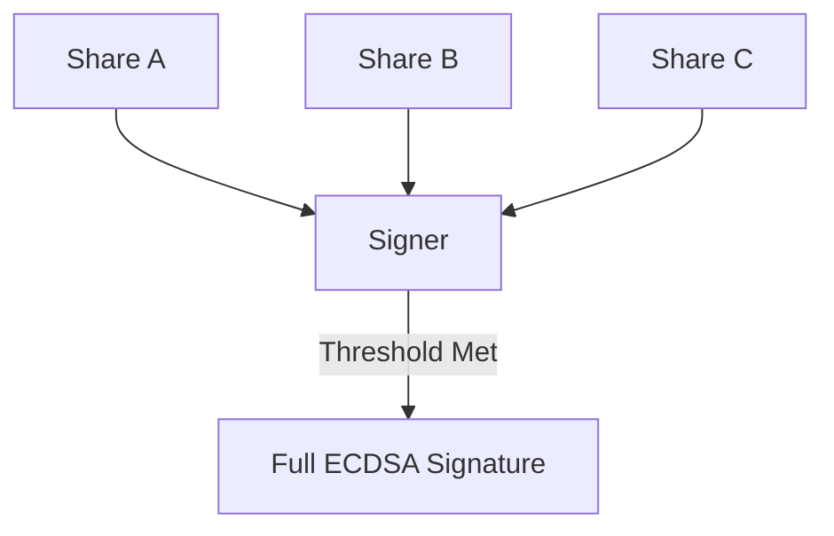

# dart_web3_mpc

Multi-Party Computation (MPC) and Threshold Signature (TSS) library.

## Features

- **TSS Protocols**: (Coming Soon) Implementations of GG18/GG20 for distributed signing.
- **Key Sharding**: Split a private key into multiple shards for distributed custody.
- **Threshold Security**: Sign transactions only when a defined $n$-of-$m$ threshold of participants is met.
- **Wallet Agnostic**: Pure logic layer that can be used with any communication backend.

## Architecture



## Usage

```dart
import 'package:dart_web3_mpc/dart_web3_mpc.dart';

void main() {
  final mpc = MPCWallet();
  final shares = mpc.generateShares(n: 2, m: 3);
  print('Generated 3 shares with 2-of-3 threshold');
}
```

## Installation

```yaml
dependencies:
  dart_web3_mpc: ^0.1.0
```
