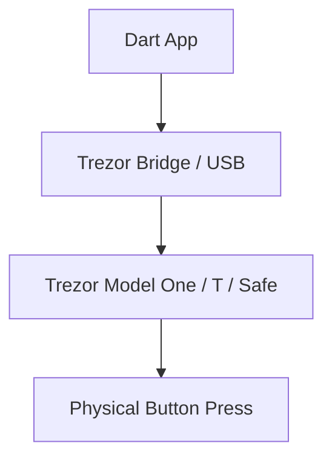

# dart_web3_trezor

Secure key management and signing using Trezor hardware wallets.

## Features

- **Communication**: Support for Trezor Bridge and USB communication.
- **Passphrase Security**: Native support for hidden wallets via the passphrase feature.
- **Multi-Asset**: Unified interface for signing Ethereum and Bitcoin transactions.
- **On-Device Verification**: Confirm withdrawal addresses and transaction details on-screen.

## Architecture



## Usage

```dart
import 'package:dart_web3_trezor/dart_web3_trezor.dart';

void main() async {
  final trezor = TrezorClient();
  final address = await trezor.getAddress(coin: 'Ethereum');
  print('Trezor Address: $address');
}
```

## Installation

```yaml
dependencies:
  dart_web3_trezor: ^0.1.0
```
