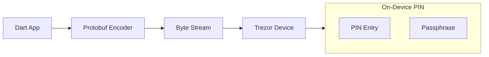

# dart_web3_trezor

[](https://pub.dev/packages/dart_web3_trezor)
[](https://opensource.org/licenses/MIT)

Industry-standard **Trezor hardware wallet integration** for Dart. Communicates with Trezor One, Trezor T, and Trezor Safe devices via the Trezor Protobuf (Bridge) protocol.

## 🚀 Features

- **Protobuf Support**: High-performance serialization using official Trezor message definitions.
- **USB HID / Bridge**: Direct communication on Desktop and support for Trezor Bridge on Web/Mobile.
- **Passphrase Security**: Native handling of the Trezor "hidden wallet" (passphrase) entry.
- **Type-Safe Commands**: Typed requests for Address, Signing, and CipherKey derivation.

## 🏗️ Architecture



## 📚 Technical Reference

### Core Classes
| Class | Responsibility |
|-------|----------------|
| `TrezorClient` | The primary interface for device commands. |
| `TrezorMessage` | Wrapper for specific protobuf-defined interactions. |
| `TrezorTransport` | Strategy for USB vs. Bridge communication. |
| `TrezorSigner` | Integration with the `dart_web3_signer` interface. |

## 🛡️ Security Considerations

- **PIN Entry**: The SDK supports remote PIN entry for UI flexibility, but encourage users to enter PINs on the device (Trezor T) when possible for maximum security.
- **Passphrase Risk**: Emphasize that a lost Trezor passphrase means permanent loss of funds. The SDK provides clear hooks for passphrase prompting.
- **Code Audit**: The Trezor integration touches sensitive byte-level logic. This module is written in pure Dart to be easily auditable.

## 💻 Usage

### Signing a Message
```dart
import 'package:dart_web3_trezor/dart_web3_trezor.dart';

void main() async {
  final trezor = TrezorClient.usb();
  await trezor.connect();

  final signature = await trezor.signMessage(
    message: "I am the owner of this wallet",
    path: "m/44'/60'/0'/0/0",
  );

  print('Signed by Trezor: $signature');
}
```

## 📦 Installation

```yaml
dependencies:
  dart_web3_trezor: ^0.1.0
```
