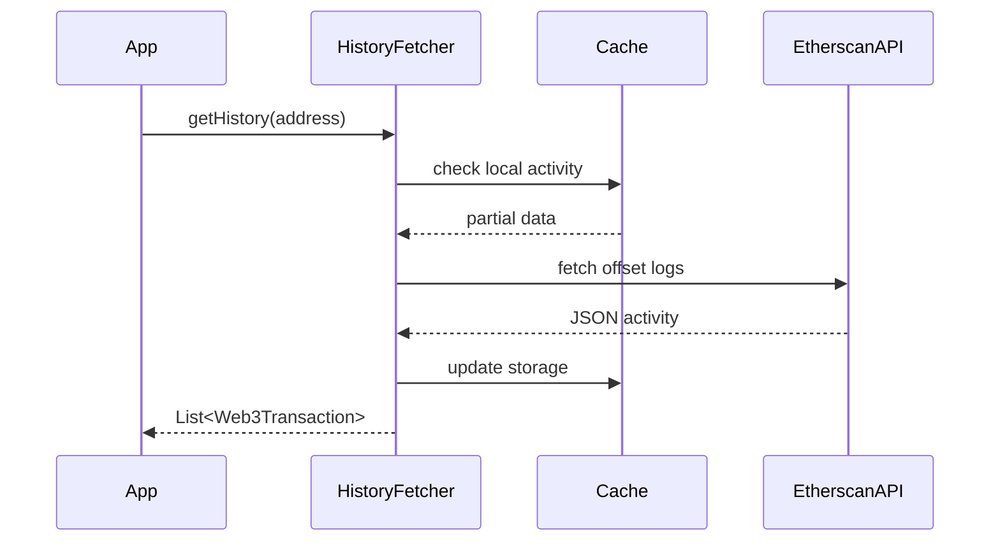
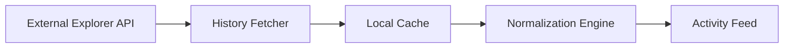

# dart_web3_history

[](https://pub.dev/packages/dart_web3_history)
[](https://opensource.org/licenses/MIT)

A **data-rich transaction explorer** for Web3 applications. Fetch, parse, and normalize account history from multiple sources to provide a clean activity feed for your users.

## 🚀 Features

- **Multi-Source Fetching**: Support for Etherscan, Polygonscan, and custom RPC-based indexers.
- **Contract Decoding**: (Planned) Integrated with ABI engine to show human-readable actions (e.g., "Swapped ETH for DAI") instead of raw hex.
- **Local Persistence**: Efficient SQLite/Hive-ready caching to reduce API overhead.
- **Multilingual Labels**: Configurable labels for system transactions and contract interactions.

## Usage Flow


## 🏗️ Architecture



## 📚 Technical Reference

### Core Classes
| Class | Responsibility |
|-------|----------------|
| `HistoryFetcher` | Communicates with external indexing services. |
| `Web3Transaction` | A normalized representation of a cross-platform transaction. |
| `HistoryCache` | Persistence layer definitions for transaction storage. |
| `ActionDecoder` | Maps method selectors to human-readable labels. |

## 🛡️ Security Considerations

- **API Key Privacy**: Always use environment variables for explorer API keys. Never hardcode them in your client-side Flutter code.
- **Trustworthy Data**: While explorers are convenient, they are centralized. For critical balance UI, verify through the `dart_web3_client` for the most recent block state.
- **Payload Sanitization**: When displaying "Input Data" or "Calldata" strings, sanitize them to prevent injection or crashes in text rendering components.

## 💻 Usage

### Fetching Activity Feed
```dart
import 'package:dart_web3_history/dart_web3_history.dart';

void main() async {
  final history = HistoryFetcher(
    provider: HistoryProviders.etherscan,
    apiKey: '...',
  );

  final transactions = await history.getAccountActivity('0x...');
  
  for (var tx in transactions) {
     print('Time: ${tx.timestamp}, Hash: ${tx.hash}');
  }
}
```

## 📦 Installation

```yaml
dependencies:
  dart_web3_history: ^0.1.0
```
