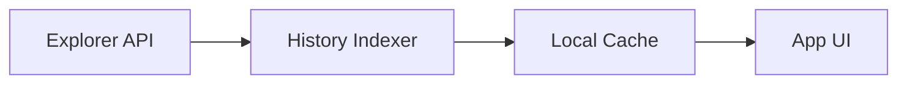

# dart_web3_history

Transaction and account history explorer for Web3 applications.

## Features

- **Indexing**: Fetch and normalize transaction history from various chain explorers.
- **Decoders**: Built-in support for decoding system transactions and common smart contract interactions.
- **Caching**: Efficient local caching layer to reduce RPC/Explorer API calls.
- **Pagination**: Easy-to-use pagination controls for long transaction lists.

## Architecture



## Usage

```dart
import 'package:dart_web3_history/dart_web3_history.dart';

void main() async {
  final history = HistoryIndexer(apiKey: '...');
  final txs = await history.getTransactions('0x...');
}
```

## Installation

```yaml
dependencies:
  dart_web3_history: ^0.1.0
```
